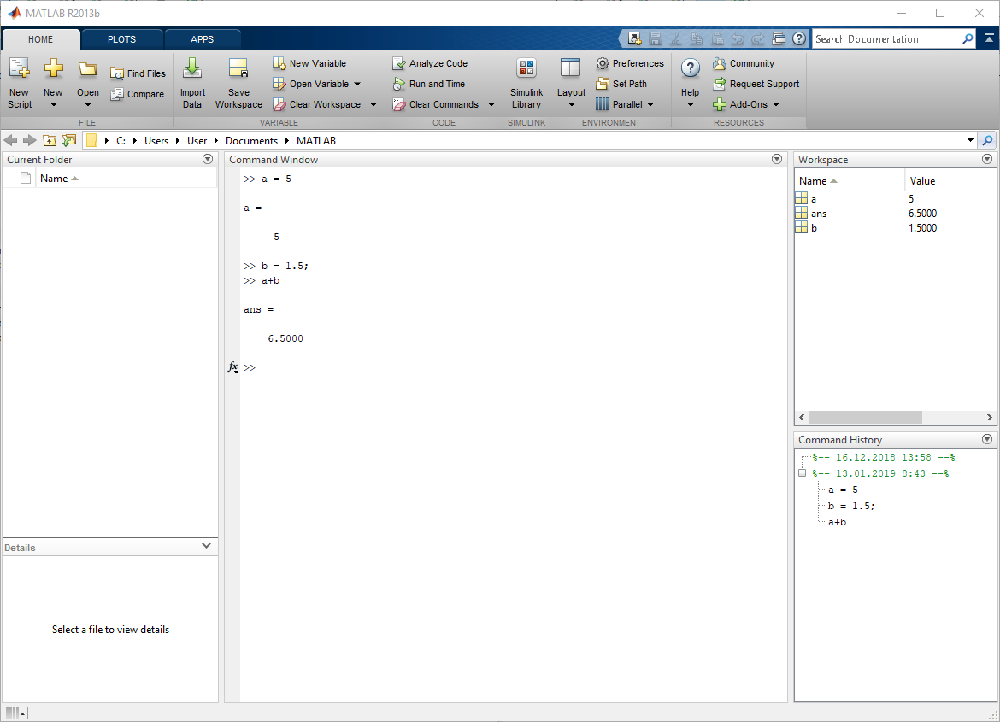
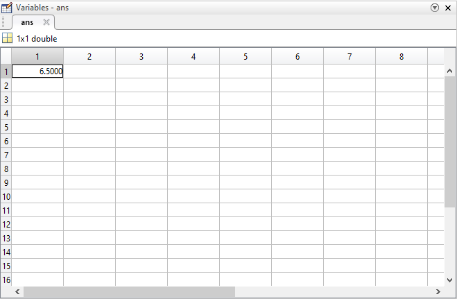
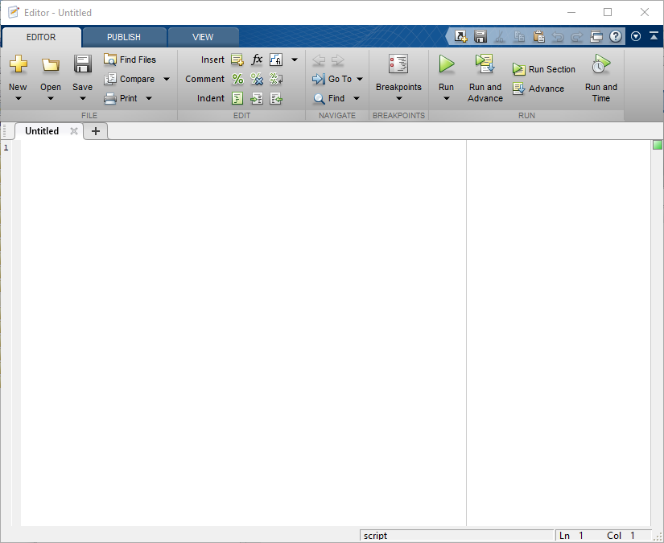
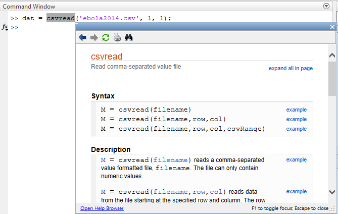
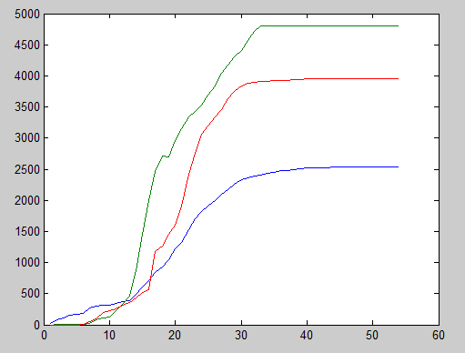
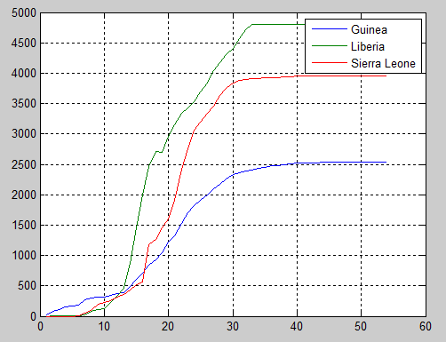
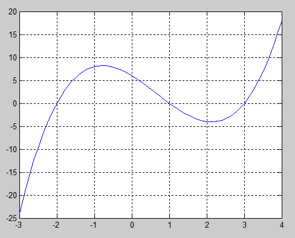
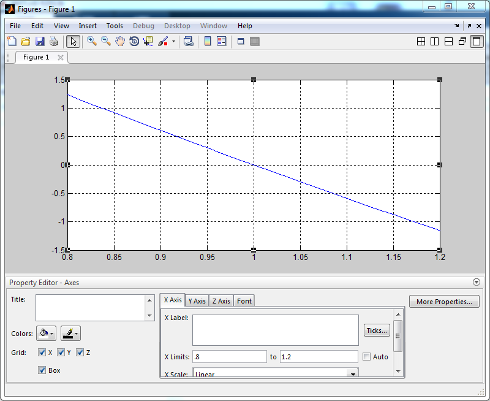
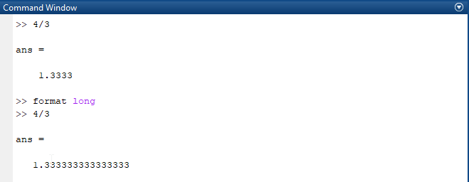
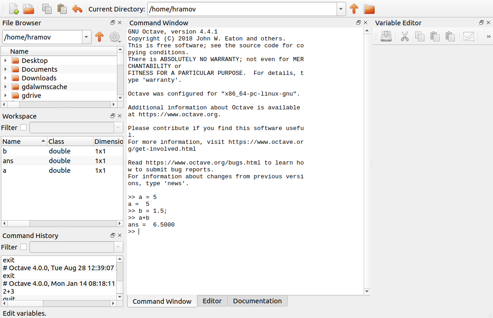

## Содержание

* Научные вычисления: что это такое и как это делается
* Matlab
* *Сложение матриц: С и Matlab*
* Интерфейс Matlab
* Окна: командное окно, рабочая среда (Workspace), редактор, справка
* *Данные по смертности от лихорадки Эбола*
* Переменные
* Типы данных
* Ключевая роль массивов
* Операции и их приоритет
* Элементарные функции
* *Поиск корней уравнения*
* Специальные значения
* Бесплатная альтернатива Matlab
* Онлайновые и настольные версии
* Информационные ресурсы


## Научные вычисления

Научные вычисления (scientific computing, сomputational science) — решение научных задач с помощью компьютеров. 

* Задачи чаще всего относятся к области естественных наук (физики, химии, биологии и др.) или к математике.
* Научные вычисления называют “третьим столпом науки”, наряду с теоретическим анализом и экспериментами.
* Грань между научными вычислениями и науками, являющимися источниками задач, проходит между интересом к методам решения задач и решением самих задач.

Компьютер позволяет выполнять расчеты:

* быстрее;
* дешевле;
* иным способом, чем это было в "докомпьютерную эпоху".


## Как это делается

Научные вычисления предполагают:

1. создание математической модели — приближенного описания явления на языке математики,
2. реализацию модели на языке программирования,
3. выполнение расчетов,
4. проверку правильности результатов.

Для этого нужно знать:

* **Математику**
* Программирование
* Вычислительные методы
* Математическое моделирование


## Matlab

](images/cleve_moler_linpack.png)


## Сложение матриц: С

\footnotesize

```
#include <stdio.h> 
#define N 3 
  
int main() 
{ 
    int A[N][N] = { {1, 1, 1}, 
                    {2, 2, 2}, 
                    {3, 3, 3}}; 
    int B[N][N] = { {1, 1, 1}, 
                    {2, 2, 2}, 
                    {3, 3, 3}}; 
    int C[N][N];
    int i, j; 

    for (i = 0; i < N; i++) 
        for (j = 0; j < N; j++) 
            C[i][j] = A[i][j] + B[i][j]; 
  
    // Print result here...

    return 0; 
}
```


## Сложение матриц: Matlab

\footnotesize

```
A = [1, 1, 1; 
     2, 2, 2; 
     3, 3, 3]; 
B = [1, 1, 1; 
     2, 2, 2; 
     3, 3, 3];
     
A+B
```

* нет директив препроцессора
* нет описания типов данных
* нет циклов
* есть вывод

А как со скоростью?


## Пример неэффективного (но рабочего) кода Matlab

\footnotesize

```
A = [[1, 1, 1]; 
     [2, 2, 2]; 
     [3, 3, 3]]; 
B = [[1, 1, 1]; 
     [2, 2, 2]; 
     [3, 3, 3]]; 
C = zeros(size(A));

for i = 1:3
    for j = 1:3
        C(i,j) = A(i,j) + B(i,j);
    end
end

C
```


## Интерфейс Matlab




## Окна

* **Командное окно** (Command Window) — набираем команды и нажатием *Enter* отправляем их на выполнение.
    * *Shift-Enter* — перевод строки
    * `clc` — очистка командного окна
    * $\uparrow$, $\downarrow$ — перемещение по истории команд
* **Рабочая среда** (Workspace) — просмотр содержимого памяти.
    * `clear` — очистка содержимого памяти
* **История команд** (Command History).


## Рабочая среда (Workspace)




## *Ctrl+N* - вызываем редактор




## *F1* - Справка




## ПРИМЕР. Данные по смертности от лихорадки Эбола

Файл `ebola2014.csv`:

```
Date,Guinea,Liberia,Sierra.Leone
2014-03-22,29,0,0
2014-03-31,80,2,0
2014-04-14,108,2,0
2014-05-01,149,11,0
...
```

Скрипт `plot_graph.m`:

```
dat = csvread('ebola2014.csv', 1, 1);
plot(dat)
```

\tiny

Данные: https://en.wikipedia.org/wiki/West_African_Ebola_virus_epidemic_timeline_of_reported_cases_and_deaths


## Запустим скрипт




## Украсим результат




## Переменные

\small

```
a = 3.5 % Переменная = Значение[;]
b3 = 1
A = 6
```

';' – ставят после промежуточных вычислений для подавления вывода в командное окно или для разделения команд в одной строке.

Язык Matlab – РЕГИСТРОзависимый.

`ans` (от *answer*) – имя "анонимной" переменной.

`%` – начало комментария.

Синтаксис переменных: 

* латиница, цифры, знак подчеркивания, 
* начинается с буквы, 
* кроме зарезервированных слов (for, end, if, else, case,...). 

**Внимание! Правила относительно имен переменных распространяются на функции, а также на файлы и папки.**


## Типы данных

Все числовые переменные по умолчанию имеют тип `double` – 8 байт. Поэтому нет необходимости указывать тип переменных. Однако в языке есть функции для явного приведения типов.

Другие типы данных: 

* Строковые: `'Hello world'`, `'Aren''t you crazy?'` — выражение в одинарных кавычках является строковой переменной.
* Комплексные числа: `z = 3+6i`.
* `int*`, `uint*` — целые числа полезны при работе с изображениями.
* ...

Контейнеры: 

* массивы, структуры (structure), ячейки (cell), таблицы (table).

Узнать тип данных A: `class(A)`


## Матрицы

* Все числовые переменные в Matlab — это матрицы (массивы).
* Matlab = MATrix LABoratory.
* Скаляр — матрица размерности 1х1.

```
a = [1 2 3 4 5 6 7 8 9]   % матрица 1х9
b = [1,2,3,4,5,6,7,8,9]'  %         9х1
A = [1 2 3; 4 5 6; 7 8 9] %         3х3
```

* Матрицы записываются по строкам
* Строки разделяются ";"
* Столбцы разделяются пробелами или ","

```
A = [1 2 3; 
     4 5 6; 
     7 8 9]
```


## Обращение к элементам

* Нумерация элементов начинается с 1.

```
a = [1 2 3 4 5 6 7 8 9]
a(1)     % первый элемент
a(end)   % последний элемент
a(3:5)   % элементы с 3-го по 5-й
a([5,7]) % элементы 5-й и 7-й
```

* двоеточие `:` задает диапазон изменений — `с:по`

```
x =  начало:шаг:конец;
```
```
a = 1:9    % 1 2 3 4 5 6 7 8 9
b = 1:3:9  % 1 4 7
c = 9:-2:0 % 9 7 5 3 1
```


## Поэлементные операции

\small

Matlab трактует `*, /, ^` как операции, выполняемые по правилам линейной алгебры.

```
x = [1 2 3];
y = [3 4 5];
x * y
```
Дает:
```
Error using  * 
Inner matrix dimensions must agree.
```

Для выполнения операций над отдельными элементами матриц нужно поставить перед знаком нужной операции точку: `.*, ./, .^`


```
x .* y
```
```
ans =

     3     8    15
```


## Приоритет операций

Операция | Описание
---------|------------
`()`     | изменяют приоритет операций
`'`      | транспонирование
`^`      | возведение в степень
`.^`     | поэлементное возведение в степень
`\`      | матричное деление
`*`, `/` | умножение, деление
`.*`, `./` | поэлементное умножение, поэлементное деление
`+`, `-` | сложение, вычитание


## Элементарные функции

```
sin(x), cos(x), tan(x), cot(x), 
sqrt(x), 
exp(x), log(x), log10(x),
sinh(x), cosh(x), tanh(x)
```

* Аргументы тригонометрических функций задаются в радианах.
* Найти `x` радиан по заданным `d` градусам можно с помощью пропорции:
`x/d = pi/180`, т.е. `x = d*pi/180`.
* Аргументы тригонометрических функций `cosd()`, `sind()` задаются в градусах.


## ПРИМЕР. Поиск корней уравнения

Найдем корень уравнения
$$
x^3-2x^2-5x+6=0,
$$
расположенный на промежутке $[0;2]$ с точностью до 0.01.


## Строим график

```
x = -3:.1:4;
y = x.^3 - 2*x.^2 - 5*x + 6;
plot(x,y), grid on
```

* Попробуйте построить график с шагом по x, равным 1.
* Посмотрите, как выглядит матрица x в Workspace.


## 




## Ограничиваем область поиска корня: меню Edit/Axes Properties...


## Сужаем окрестность корня (XLimits) пока не достигнем нужной точности




## format: представление чисел в командном окне




## Специальные значения

Бесконечности:
``` 
Inf = 1/0 
-Inf = -1/0 
```

Not-a-Number:
```
NaN = 0/0
```

Математические константы:
```
pi
e = exp(1)
```


## Бесплатная альтернатива Matlab

* [GNU Octave](https://www.gnu.org/software/octave/) — ближайший аналог
* [Scilab](https://www.scilab.org)
* Python + NumPy + SciPy
* [Julia](https://julialang.org)


## Интерфейс GNU Octave




## Версии

### Online

* Matlab Online: https://matlab.mathworks.com/ (бесплатная регистрация)
* Octave Online: https://octave-online.net (без регистрации)

### Настольные

* `>` Matlab R2013b — работает на Windows 7 и Windows 10 (вот как она выглядит: https://rutracker.org/forum/viewtopic.php?t=4554638)


## Информационные ресурсы

1. Ануфриев И.Е. и др. MATLAB 7.
2. Хант Б. и др. MATLAB R2007 с нуля!
3. MATLAB: язык технических вычислений.
4. matlab.exponenta.ru
5. [dkhramov.dp.ua: m-файлы примеров](http://dkhramov.dp.ua/Sci.M-files.html)

### Вспоминаем математику

* Бёрд Дж. Инженерная математика: Карманный справочник. М.: Издательский дом «Додэка-ХХI», 2008. 544 с.

### Где искать книги

* Папка `/lit`
* [Library Genesis: gen.lib.rus.ec](http://gen.lib.rus.ec)


## Контактная информация

\centering

**Преподаватель**: Храмов Дмитрий Александрович, доцент, к.т.н.

**e-mail**: `dkhramov@mail.ru`

**веб-сайт**: [dkhramov.dp.ua](http://dkhramov.dp.ua/)

**skype**: `d_khramov`

**GitHub**: https://github.com/dkhramov

