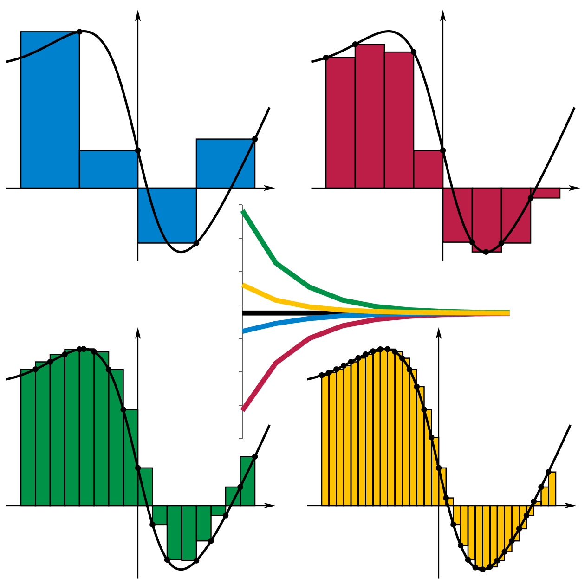

## В этой лекции

* Работа с массивами: создание, обращение к элементам, удаление.
* Векторизация — работа с целым массивом вместо поэлементной обработки.
* Логическая индексация — выбор элементов массива, благодаря которому работает векторизация.


## Обращение к элементам массива

Массив формируется по строкам:

```
A = [1,2,3; 4,5,6; 7,8,9];

>> A

A =

     1     2     3
     4     5     6
     7     8     9
```

```
A(1,2)      % элемент 1-й строки и 2-го столбца (2)
A(:,1)      % 1-й столбец
A(2:3,:)    % строки 2 и 3
A(3,[1,3])  % элементы 1-го и 3-го столбца 3-й строки
A(5)        % ?  
```


## Создание массивов: eye, ones, zeros

\footnotesize

```
>> B = eye(3)

B =

     1     0     0
     0     1     0
     0     0     1

>> C = ones(2)

C =

     1     1
     1     1

>> D = zeros(1,3)

D =

     0     0     0
```


## Создание массивов: rand

\small

`rand()` создает случайную величину, равномерно распределенную на интервале [0;1].

\footnotesize

```
>> rand

ans =

    0.8147

>> rand(2,1)

ans =

    0.9058
    0.1270
```    

\small
Случайная величина, равномерно распределенная на интервале [a;b]:

\footnotesize

```
ab = a + (b-a)*rand()
```


## Удаление строк и столбцов

```
A = [1,2,3; 4,5,6; 7,8,9];
A(:,1) = 0;  % обнуление 1-го столбца
A(:,1) = []; % удаление 1-го столбца
```


## Объединение матриц

```
A = [1 2; 3 4];
B = [5 6; 7 8];

C = [A  B];
D = [A; B];

>> C =

     1     2     5     6
     3     4     7     8

>> D =

     1     2
     3     4
     5     6
     7     8
```


## Создание многомерных массивов

```
A = [1 2; 3 4];
```

На самом деле 3-е измерение уже есть! `A(:,:,1)` — это исходная матрица `A`.

Добавим в 3-е измерение `A` еще один слой:

```
A(:,:,2) = [5 6; 7 8];
```


## Создание многомерных массивов - 2

```
>> A

A(:,:,1) =

     1     2
     3     4

A(:,:,2) =

     5     6
     7     8
     
>> size(A)

ans =

     2     2     2
```


## Создание многомерных массивов: cat

cat (*conCATenation*) объединяет матрицы `A` и `B` вдоль измерения `dim`:

```
C = cat(dim, A, B)

A = [1 2; 3 4];
B = [5 6; 7 8];

C1 = cat(1, A, B); % [1 2; 3 4; 5 6; 7 8]
C2 = cat(2, A, B); % [1 2 5 6; 3 4 7 8]
C3 = cat(3, A, B); % size(C3) = 2x2x2
```


## ПРИМЕР. Обработка изображений


## Код

```
% загрузим картинку
A = imread('lena.png');

% Red
subplot(2,2,1), imshow(A(:,:,1))
% Green
subplot(2,2,2), imshow(A(:,:,2))
% Оставляем только синий канал
A(:,:,[1,2]) = [];
subplot(2,2,3), imshow(A);
% Комплимент от повара
subplot(2,2,4), plot(-pi:.1:pi, sin(-pi:.1:pi));
```


## Несколько рисунков в одном окне


## Линейная индексация 

```
A = [1 2 3; 
     4 5 6];

% Что даст
A(2)
```

К элементу массива можно обратиться по единственному индексу — номеру элемента от начала массива.


## Линейная индексация — 2

Нумерация элементов массива идет по столбцам:

```
A = [1 2 3; 
     4 5 6];
     
>> for i = 1:6, disp(A(i)), end

     1
     4
     2
     5
     3
     6
```


## Изменение формы массива: reshape

Синтаксис: `Y = reshape(X,M,N)`

* Преобразование формы идет по столбцам.
* M, N — количество строк и столбцов соответственно в формируемом массиве.
* Число элементов в массивах X и Y должно совпадать.

```
A = [1 2 3; 
     4 5 6];
     
B = reshape(A,3,2)

B = [1 5;
     4 3;
     2 6]
```


## Другие операции над массивами

**Размеры**

* `length(x)` — длина вектора;
* `[i,j] = size(A,dim)` — размерность матрицы;
* Создать матрицу того же размера, что и А: `B = ones(size(A))`.

**Максимумы/минимумы**

* `max, min` — для матрицы: поиск максимальных (минимальных) элементов по столбцам;
* max(max(A)) — максимум для матрицы A. 

**Другое**

* `sum, prod` — сумма и произведение элементов массива;
* `round` — округление, `fix` — усечение.


##

\footnotesize

```
A = rand(3)
max(A)
max(max(A))

A =

    0.7060    0.0462    0.6948
    0.0318    0.0971    0.3171
    0.2769    0.8235    0.9502


ans =

    0.7060    0.8235    0.9502


ans =

    0.9502
```


## Обращение матриц

\footnotesize

```
A = rand(2);
A_inv = inv(A); % inv(A) = A^(-1) = A^-1
I = A*A_inv;

>> A

A =
    0.7431    0.6555
    0.3922    0.1712

>> A_inv

A_inv =
   -1.3180    5.0467
    3.0199   -5.7216

>> I

I =
    1.0000    0.0000
   -0.0000    1.0000
```


## Логический тип данных

Логический тип данных (logical) представляет состояния ИСТИНА и ЛОЖЬ с помощью чисел 1 и 0 соответственно.

* **Сравнения:** `== (тождество), <, >, <=, >=, ~= (не равно)`
* **Операции:** `& (И), | (ИЛИ), ~(НЕ)`

**Важно!** `'=='` — тождество, а `'='` — присваивание.

\small

Есть еще `&& (И)` и `|| (ИЛИ)` — они применяются для скаляров и реализуют короткий цикл вычислений (второй операнд оценивается только в том случае, когда результат не определяется полностью первым операндом).


## Обращение к элементам массива

Обращаться к элементам массива можно:

1. по их номерам (числовым индексам);
2. с помощью **логической индексации**.

  |  |  |  |  |  |
--|--|--|--|--|--|
A |6 |7 |8 |9 |10|
LI|0 |0 |1 |0 |1 |

**Логический индекс (маска)** — это массив, имеющий тот же размер, что и исходный A, но состоящий из 0 и 1. Единицы указывают на выбранные элементы исходного массива A.

Выберем 3-й и 5-й элементы массива A:

* A([3,5]))
* A([0,0,1,0,1])


## Векторизация условий

Логическая индексация позволяет векторизовать условия.

Пусть у нас есть массив D:
```
D = [-0.2 1.0 1.5 3.0 -1.0 4.2 3.14];
```

Выберем из него положительные элементы

```
D >= 0 

  ans =  0 1 1 1 0 1 1 
```

Положительные элементы D — единицы, отрицательные — нули.

Сколько всего положительных элементов в D?

```
sum(D >= 0)
```

Выделим массив из положительных элементов D:

```
P = D(D>=0);
```


## ПРИМЕР. Вычисление интеграла методом Монте-Карло


## Идея

\Large

1. Помещаем фигуру в другую, с известной площадью (прямоугольник).
2. Генерируем $n$ точек со случайными координатами внутри прямоугольника.
3. Подсчитываем, сколько точек попало внутрь фигуры $n_s$.

```
Площадь_фигуры = Площадь_прямоугольника*ns/n
```


##

$$
F(x) = \int_a^b f(x) dx
$$

* $A = H(b-a)$ — площадь прямоугольника;
* $n$ — число испытаний;
* $n_s$ — число точек, лежащих под кривой $y=f(x)$.

### Алгоритм

1. Генерируем $n$ пар случайных чисел $(x_i,y_i)$: $a \leq x_i \leq b$, $0 \leq y_i \leq H$.
2. Для каждой пары $(x_i,y_i)$ проверяем условие $y_i \leq f(x_i)$ и подсчитываем число удовлетворяющих ему пар $n_s$.

Формула для вычисления интеграла:

$$
F(x) = A\frac{n_s}{n} .
$$


## 

Вычислим интеграл
$$
F(x) = \int_1^2 x^2 dx
$$
с точностью 0.01.

```
% Возьмем n точек
n = 1e6;
% Генерируем точки, попадающие в прямоугольник [1,2;0,4]
x = 1 + rand(1,n);
y = 4*rand(1,n);
% Вычислим значения функции для случайных x
f = x.^2;
% Подсчитаем число попаданий под кривую f(x)=x^2
ns = sum(y <= f);
% Вычислим площадь как долю площади прямоугольника
area_rect = (2-1)*(4-0);
area = ns/n*area_rect
```


## Объемлющая фигура


## Точное значение интеграла

```
% Вариант 1
F = int(sym('x^2'),1,2)
% Вариант 2
syms x
F = int(x^2,1,2)

  7/3
```


## Проверка точности вычисления интеграла

```
area = 2.3369 % У вас будет другое значение
abs(area - 7/3) = 0.0035
```

Уменьшение значений `n` показало, что уже при `n = 1e4` точность становится лучше требуемой `0.01`.


## ПРИМЕР. Вычисление $\pi$

\bcols
\column{.5\textwidth}

\column{.5\textwidth}

\ecols
$$
\frac{n_s}{n} \approx \frac{S_{circle}}{S_{square}} = \frac{\pi r^2}{a^2} \Rightarrow
$$
$$
\pi \approx 4\frac{n_s}{n}
$$
$a = 2r$ — длина стороны квадрата.


## Код

\Large

```
% Задаем число точек
n = 1e6;
% Генерируем точки внутри квадрата
x = rand(1,n);
y = rand(1,n);
% Задаем абсциссы четверти круга
fun = sqrt(1-x.^2);
% Счетчик попаданий внутрь окружности
ns = sum(y <= fun);
pi_ = 4*ns/n
```


## Выгода от логической индексации

Конструкция
```
ns = 0;
for i=1:n
    if y(i) <= fun(i)
        ns = ns + 1;
    end
end
```
заменяется на:
```
ns = sum(y <= fun);
```


## Think vectorized

Девиз Matlab: "Думай векторно" (Think vectorized), то есть — думай о массиве в целом, а не об отдельных элементах.

Благодаря логической индексации в Matlab реже используются условные операторы и циклы.

Замена условных операторов и циклов операциями над массивом в целом называется **векторизацией.**

**Но:** пишете как вам проще — чтобы это работало. Когда программа заработает правильно, будете думать об улучшениях.


## ПРИМЕР. Метод прямоугольников




## Левые и правые прямоугольники

\bcols
\column{.5\textwidth}

\column{.5\textwidth}

\ecols


## Первый подход

```
h = 0.01;
x = 1:h:2;
sum(x.^2*h)

ans =

    2.3584
```

Многовато!


## Левые и правые прямоугольники

```
h = 0.01;
x = 1:h:2;
left = sum(x(1:end-1).^2*h)
right = sum(x(2:end).^2*h)

left =

    2.3184


right =

    2.3484
```


## Центральные прямоугольники

\bcols
\column{.5\textwidth}

\column{.5\textwidth}
```
h = 0.01;
x = 1:h:2;
left = sum(x(1:end-1).^2*h);
right = sum(x(2:end).^2*h);
(left + right)/2

ans =

    2.3334
```
\ecols

