## Содержание

\footnotesize

* Условный оператор if. *Примеры*
* Проверка векторного условия
* Функции составления условий: any, all
* Оператор множественного выбора switch
* *Выбор типа графика*
* Цикл с условием
* *Простой процент*
* Цикл со счетчиком. *Примеры*
* Вложение циклов
* Прерывание цикла (break) и пропуск итераций (continue)
* Основная функция двумерной графики: plot
* Цвет кривых, стиль линии и маркер точки
* Графики в общих осях координат
* Создание графических окон
* Управление свойствами осей координат
* *Единичная окружность*
* Текст и подписи к осям
* Заголовок графика
* Специализированные графики. Полярные координаты
* *Моделирование диффузии*
* *Решение систем линейных уравнений *


## Виды вычислительных процессов

\small

1. **Линейный** -- все этапы решения задачи выполняются в порядке следования записи этих этапов.
2. **Ветвящийся** -- выбор направления обработки информации зависит от результатов проверки выполнения логического условия.
3. **Циклический** -- содержит многократно повторяемый участок вычислений (цикл).

По количеству выполнения циклы делятся на:

* **циклы со счетчиком**, т.е. заранее заданным числом повторений
* **циклы с условием**. Количество повторений заранее не определено и зависит от соблюдения некоторого логического условия.
    * цикл с предусловием -- условие проверяется в начале цикла;
    * цикл с постусловием -- условие проверяется в конце цикла.


## Условный оператор if – выбор из вариантов

Синтаксис:

```
if усл1
  действия1   % выполняются, если  усл1 == 1
 [elseif усл2
    действия2 % выполняются, если усл1 == 0, но усл2 == 1]
    ...
 [else
    действия3]
end
```

**Не забываем про отступы!** Код пишется для человека.

Короткий вариант:

```
if усл1 действия1, else действия2, end
```


## ПРИМЕР. Решение квадратного уравнения

```
a = ..; b =..; с = ..;
D = sqrt(b^2 – 4*a*c);
eps = 1e-6;

if D > eps
    x(1)=..; x(2) = ..;
  elseif abs(D) < eps
    x = ..;
  else
    disp('корней нет');
end
```

disp() - "культурный" вывод значения в CW, вместо присвоения безымянной переменной `ans`.


## ПРИМЕР. Проверка пороговых значений

```
x = 10;
minVal = 2;
maxVal = 6;

if (x >= minVal) && (x <= maxVal)
    disp('Значение попадает в заданный диапазон.')
elseif (x > maxVal)
    disp('Значение находится выше диапазона.')
else
    disp('Значение находится ниже диапазона.')
end
```

\footnotesize

*Источник:* https://se.mathworks.com/help/matlab/ref/if.html


## ПРИМЕР. Сравнение строк

```
reply = input('Хотите установить программу? (y/n): ','s');
if strcmp(reply,'y')
  disp(reply)
end
```

\footnotesize

*Источник:* https://se.mathworks.com/help/matlab/ref/if.html


## ПРИМЕР. Равны ли размеры массивов?

```
A = ...
B = ones(2,3);

if isequal(size(A),size(B))
   C = [A; B];
else
   disp('A and B are not the same size.')
   C = [];
end
```


## Функции составления условий: `is*`

\tiny

* iscell -- Determine if input is cell array
* ischar -- Determine if input is character array
* iscolumn -- Determine whether input is column vector
* isdir -- Determine if input is folder
* isempty -- Determine if input is empty array
* isequal -- Determine if arrays are numerically equal
* isequaln -- Determine if arrays are numerically equal, treating NaNs as equal
* isevent -- Determine if input is Component Object Model (COM) object event
* isfinite -- Detect finite elements of array
* isfloat -- Determine if input is floating-point array
* isglobal -- Determine if input is global variable
* ishandle -- Detect valid graphics object handles
* ishold -- Determine if graphics hold state is on
* isinf -- Detect infinite elements of array
* isinteger -- Determine if input is integer array
* isjava -- Determine if input is Java object
* iskeyword -- Determine if input is MATLAB keyword
* isletter -- Detect elements that are alphabetic letters
* islogical -- Determine if input is logical array
* ismatrix -- Determine whether input is matrix
* ismember -- Detect members of specific set
* isnan -- Detect elements of array that are not a number (NaN)
* isnumeric -- Determine if input is numeric array
* isobject -- Determine if input is MATLAB object
* ispc -- Determine if running MATLAB for PC (Windows®) platform
* isprime -- Detect prime elements of array
* isreal -- Determine if all array elements are real numbers
* isrow -- Determine whether input is row vector
* isscalar -- Determine if input is scalar
* issorted -- Determine if set elements are in sorted order
* issparse -- Determine if input is sparse array
* isstruct -- Determine if input is MATLAB structure array
* isvector -- Determine if input is vector
* ...


## Проверка векторного условия

```
D = [-0.2 1.0 1.5 3.0 -1.0 4.2 3.14];

if D >= 0 disp('Positive'), else disp('Negative'), end


    Negative
```

**Что не так?**

Грамотная реализация условия:

```
D >= 0

ans =

     0     1     1     1     0     1     1
```


## Функции составления условий: any, all

\scriptsize

```
limit = 0.75;
A = rand(5,1)

any_A = any(A > limit)
All_A = all(A > limit)
```
```
A =

    0.0975
    0.2785
    0.5469
    0.9575
    0.9649


any_A =

     1


All_A =

     0
```


## Резюме по if

\Large

* if в MATLAB нужен реже, чем в языках без векторизации -- он заменяется логической индексацией;
* if выдает скалярный результат: 1 или 0;
* существует множество функций для составления скалярных условий.


## Оператор множественного выбора switch

`switch` — выполняет ветвления, в зависимости от значений некоторой переменной или выражения.

**Выражение -- это обязательно скаляр или строка.**

```
switch выражение
  case значение1
    % выполняются, если <выражение> = <значение1>
    действия 1
  case значение2
    % выполняются, если <выражение> = <значение2>
    действия 2
  ...
  otherwise
    % выполняются, если <выражение> не совпало 
    % ни с одним из значений
    действия
end
```


## ПРИМЕР. Выбор типа графика

\footnotesize

\bcols
\column{.5\textwidth}
```
x = [12, 64, 24];

plottype = 'pie';

switch plottype
    case 'bar' 
        bar(x)
        title('Столбчатый график')
    case 'pie'
        pie3(x)
        title('Круговая диаграмма')
        legend('First','Second','Third')
    otherwise
        warning('Неизвестный тип графика.');
end
```
\column{.5\textwidth}
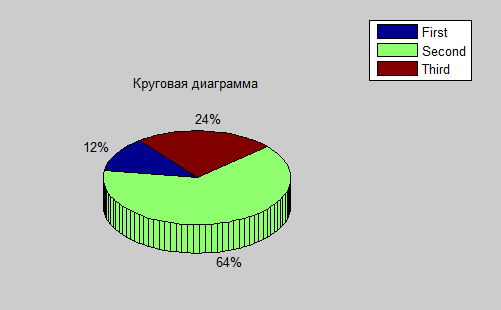
\ecols


## Оператор множественного выбора switch — 2

\Large

switch сравнивает значение выражения со значениями групп case. Выполняется первый совпадающий case.

Для числовых выражений оператор case выполняется, если `<значение>== <выражение>`. 

Для строковых выражений case выполняется, если `strcmp(значение, выражение)` истинно.


## Цикл с условием

```
while условие
  % Выполняется, пока условие истинно. 
  % Проверка — в начале действия
end
```

**Краткая форма:** `while условие, действия, end`

**Совет.** Ищите повторяющиеся действия. Запишите решение без цикла, шаг за шагом. Описав таким образом два или три шага, вы сможете увидеть, какое действие повторяется. Оно и будет телом цикла.


## ПРИМЕР. Простой процент

Простой процент — процент, рассчитанный исходя только из первоначальной основной суммы.

Исходная сумма на вкладе - 100. Норма процента за год - 19%. Через сколько лет сумма на вкладе превысит 200?

```
s0 = 100;      % исходный вклад
s = s0;        % текущая сумма на складе
np = 0.19;     % норма процента
```

Воспользуемся советом:

```
s1 = s0 + s0*np
s2 = s1 + s0*np
s3 = s2 + s0*np
...
```


## 

```
i = 0;

while s <= 200 % пока сумма на счету <= 200
  s = s + s0*np;
  i = i + 1;
end

disp([s,i])

   214     6
```


## Цикл со счетчиком

Переменной цикла присваиваются значения из заданного набора.

```
for переменная = начало : шаг : конец
  действия
end
```

Вариант цикла for, когда переменная цикла уменьшается:

```
for i = 10:-1:1
     действия
end
```

Однострочник:

```
for переменная = начало:шаг:конец, действие, end
```

## ПРИМЕР. Вычисление суммы ряда

Найти сумму элементов ряда
$$
\sum_{n=1}^{100} \frac{1}{n^2}
$$

\small

```
series = 0;

for i=1:100
    series = series + 1/i^2;
end

disp(series)
```

Результат:
```
1.6350
```

Проще сделать так:
```
series = sum(1./(1:100).^2)
```


## ПРИМЕР. Простой процент с заданным сроком вклада

```
s0 = 100;      % исходный вклад
np = 0.19;     % норма процента
n = 6;         % число лет действия вклада
s = s0;        % сумма на счету

for i = 1:n
    s = s + s0*np;
end
```


## Вложение циклов

```
for i = 1:n

  for j = 1:m
    действия1;
  end
  
  while условие
    действия2;
  end
  
end
```


## Прерывание цикла: break

`break` — выход из цикла. Во вложенных циклах выходит из внутреннего цикла. Вне цикла — прекращает выполнение скрипта или функции.

```
a = 10;

while (a < 20)
  fprintf('Значение a: %d\n', a);
    a = a+1;
    if (a > 15)
      break;
    end
end
```


## Пропуск итераций: continue

`continue` передает управление в следующую итерацию цикла, пропуская операторы, которые записаны за ним. Во вложенном цикле передает управление на следующую итерацию основного цикла.

```
a = 10;

while a < 20
  if a == 15
    % пропустить итерацию цикла
    a = a + 1;
    continue;
  end
  fprintf('Значение a: %d\n', a);
  a = a + 1;
end
```


## Резюме: операторы цикла

* Цикл с условием удобно использовать, когда неизвестно, сколько раз нужно повторять действие (это зависит от проверяемого условия). 
* Цикл со счетчиком используют, когда действие выполняется заданное число раз.
* В `while` условие должно обязательно меняться внутри цикла, иначе он будет бесконечным. 
* В `for` переменная цикла в теле цикла не изменяется, иначе не получим заданного числа повторений.


## Основная функция двумерной графики: plot

`plot(x,y,...)` — строит график зависимости y от x.

По умолчанию `plot` рисует сплошные кривые с маркером-точкой, первая кривая – синего цвета.

```
```

\bcols
\column{.5\textwidth}
Аргумент задают:

* с фиксированным шагом:

```
x = 0:pi/100:2*pi;
plot(x, sin(x))
```

* с заданным числом значений:

```
x = linspace(0,2*pi,200);
plot(x, sin(x))
```
\column{.5\textwidth}
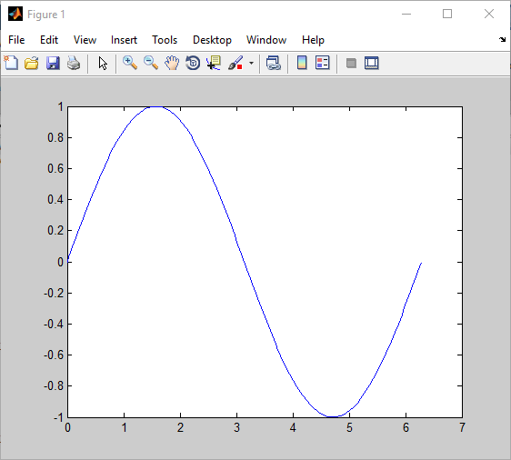
\ecols


## Предупреждение: график в виде сплошной линии не гарантирует точности вычислений! 

\bcols
\column{.5\textwidth}
Настоящих точек ровно столько, сколько задано вектором аргумента. 

Между точками проводится линейная интерполяция. 

Она не заменяет добавления новых расчетных точек!
\column{.5\textwidth}
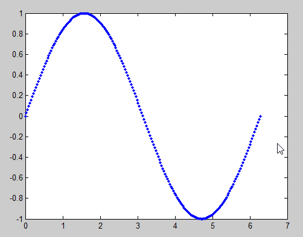
\ecols


## Цвет кривых, стиль линии и маркер точки

Полный (почти) синтаксис `plot`:

```
plot(x,y,’ЦветСтильМаркер’)
```

’ЦветСтильМаркер’ – строка из символов, задающих цвет, стиль линии, и вид маркера точек. 

\footnotesize

**Цвет**

* ‘с’ (cyan) – голубой 
* ‘m’ (magenta) – фиолетовый
* ‘y’ – желтый
* ‘r’, ‘g’, ‘b’
* ‘w’ – белый
* ‘k’ – черный

**Стиль линии**

* ‘-‘ -- сплошная
* ‘--‘ -- штриховая
* ‘-.’ -- штрихпунктирная
* ‘:’ -- пунктирная	


## Цвета, стили, маркеры – 2

**Маркер точки**

* ‘+’, ‘о’, ‘x’, ‘*’, ‘.’

Примеры:

```
'r--'  % красная штриховая, маркер точка
'cx'   % голубая сплошная, маркер крестик
'oy:'  % желтая пунктирная, маркер незакрашенный кружок
```

* Порядок расположения характеристик в строке – произвольный
* Может быть указана только часть характеристик, а остальные принимают значения по умолчанию:


## Графики в общих осях координат

```
plot(x1,y1,’csm1’,x2,y2,’csm2’,...)
```

Пример: 

```
x = linspace(0,2*pi,100);
plot(x, sin(x),'r:', x,cos(x),'k--+')
```


##

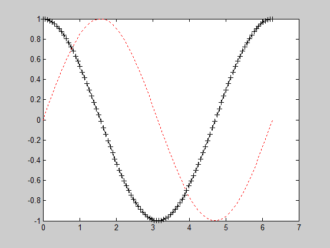


## Добавление кривых на существующий график: hold on

* По умолчанию MATLAB рисует график, стирая существующий. 
* `hold on` закрепляет существующий график, позволяя добавить к нему новый.

```
x = linspace(0,2*pi,100);
plot(x, sin(2*x))
hold on
plot(x, 2*cos(x))
grid on
```

* `hold on` работает не только между `plot`’ами, но и между другими графическими функциями.
* `grid on` включает отображение сетки на графике, `grid off` -- отключает использование сетки.
* Пара `on/off` работает аналогично в других графических командах.


##

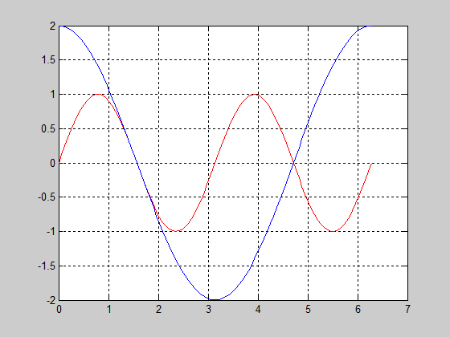


## Вывод графиков в одном графическом окне на разных координатных осях: subplot

* `subplot(m,n,p)` разделяет графическое окно на матрицу, состоящую из m x n графиков, и делает p-й график текущим. 
* Графики нумеруются по строкам: начиная с первой строчки, слева направо и сверху вниз.

```
subplot(2,2,3)
```

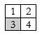


## Создание графических окон: figure

* Если графическое окно не создано, `plot` создает его.
* Создать новое графическое окно можно самостоятельно.

```
x = 0:pi/100:2*pi;
plot(x, sin(x))
figure
plot(x, cos(x))
```

Создается два графических окна. В первом будет нарисована синусоида, во втором – косинусоида. 

Номер графического окна указан в заголовке окна (Figure 1, Figure 2).

Можно управлять выводом графиков в нужное окно. Так, если открыто несколько графических окон, то функция

```
figure(2)
```

делает активным 2-е окно и графики будут выводится в него.


## Функции настройки свойств графика

\Large

Все функции, управляющие свойствами графика, располагаются в программе после функции plot (или ей подобных). 

**Принцип:** сначала строим график, потом управляем его отображением.


## Управление свойствами осей координат: axis

```
axis([xmin xmax ymin ymax])
```

Устанавливает диапазон выводимых значений координат `x` и `y`.

Начало координат помещается в нижнем левом углу. Ось $X$ направлена вправо, ось $Y$ — вверх. Как в математике.

```
x = 0:pi/100:2*pi;
plot(x, sin(x))
axis([0 2*pi -1 1])
```


## ПРИМЕР. Единичная окружность

\bcols
\column{.5\textwidth}
```
x = 0:pi/100:2*pi;
plot(exp(i*x))
```

Отчего так?

\column{.5\textwidth}
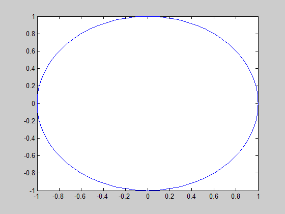
\ecols


## Команды axis

* `axis equal` –  устанавливает масштаб, который обеспечивает одинаковые расстояния вдоль осей.
* `axis square` – делает оси равной длины. Оси станут «квадратными».
* `axis on/off` – включает/отключает отображение осей координат. Удобно для вывода «художественных» рисунков.
* `axis ij` — помещает начало координат в верхний левый угол.
* `axis auto` – возвращает отображение осей в автоматический режим.
* `axis` — новое окно с «пустыми» осями.


## Устанавливаем равный масштаб вдоль осей

\bcols
\column{.5\textwidth}
```
x = 0:pi/100:2*pi;
plot(exp(i*x))
axis equal
```
\column{.5\textwidth}
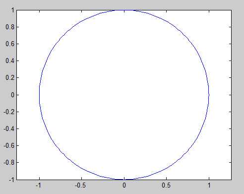
\ecols


## Текст и подписи к осям

Подписи к осям координат

```
xlabel('строка')
ylabel('строка')
```

Подписи отображаются в соответствии с американскими стандартами: в середине осей координат.

Вывод текста

```
text(x, y, ’текст’)
```

x,y – координаты точки, в которую выводится текст.


## Заголовок графика

```
title('заголовок')
```

Пример:
```
a = 5;
plot(x, a*sin(x)), grid on
axis tight
title(['a = ' num2str(a)])
```

* `num2str(x)` - конвертирует вектор x в строку символов.
*  Объединяем `'a = '` и результат `num2str(a)` в одну строку:
`['a = ' num2str(a)]`

Можно использовать различные шрифты, размеры символов, управлять их начертанием (полужирный, курсив), выводить греческие буквы и математические символы.


## 

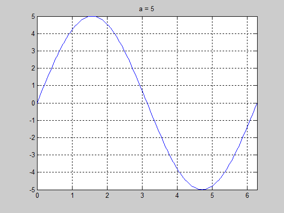


## Что происходит при выполнении plot

1. Создается графическое окно (серая подложка с меню и панелями инструментов).
2. В окне создаются оси координат (белое пространство с осями), причем автоматически подбираются диапазоны изменения переменных (`x` от и до, `y` от и до).
3. В осях строится график.

На каждом этапе работы создается объект и заданным образом изменяются его свойства. 


## Специализированные графики

\Large

Что может Excel, может и MATLAB. И даже больше.

* `bar(x,y)` -- cтолбчатая диаграмма
* `pie(x)` -- круговая диаграмма («пирог»)
* `hist(x)` -- гистограмма


## Полярные координаты

* `polar(phi,rho)` — полярные координаты; 
* `phi` – угол, `rho` – радиус (векторы одинаковой размерности).

\bcols
\column{.5\textwidth}
```
t = -pi:0.01:pi;
rho = (1+sin(t)).* ...
    (1-0.9.*abs(sin(4*t))).* ...
    (0.9+0.05*cos(200*t));
polar(t,rho,'g')
```
\column{.5\textwidth}
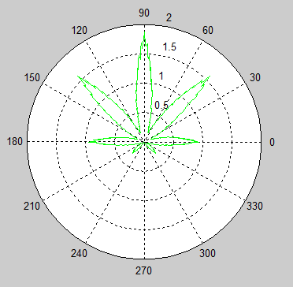
\ecols


## ПРИМЕР. Моделирование диффузии

**Диффузия** — процесс переноса вещества из области с высокой концентрацией в область с низкой концентрацией.


\scriptsize

**Источник:** http://www.visionlearning.com/en/library/Chemistry/1/Diffusion-I/216

Рассмотрим одномерный случай: диффузия в направлении оси х.


## Идея решения

Создадим массив точек (частиц).

На каждом шаге частица может двигаться вправо, влево или остаться на месте.

Через некоторое время (количество шагов) частица удалится на некоторое расстояние от источника. 

Концентрацию частиц (количество частиц в единице объема) получим при помощи гистограммы.

*Внимание:* частицы — не молекулы, они гораздо крупнее.


## Код

```
n = 150;  % число Ячеек
m = 10000; % число частиц
x = (n/2)*ones(1,m);
dice = [-1,0,+1];

for k = 1:500 % время расчета
    hist(x,m)
    axis([0,n,0,m/10]); axis square; grid on
    dx = dice( round(1+2*rand(1,m)) );
    x = x + dx;
    drawnow
end
```


## Изменение концентрации со временем

\bcols
\column{.5\textwidth}
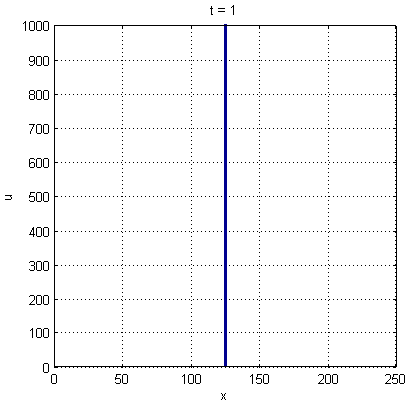
\column{.5\textwidth}
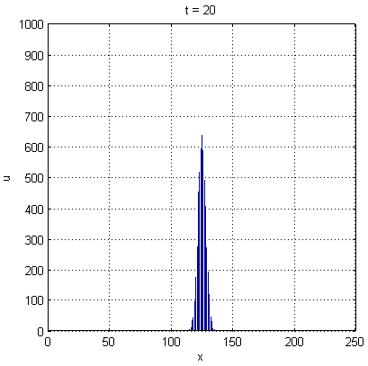
\ecols

## Изменение концентрации со временем - 2

\bcols
\column{.5\textwidth}
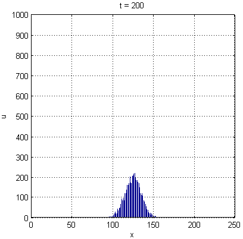
\column{.5\textwidth}
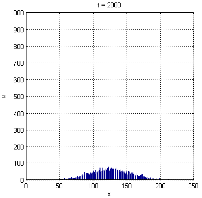
\ecols


## Развитие модели

* различные вероятности переходов, моделирующие течение или плотность среды; 
* разная длина скачка, чтобы получить решение для гетерогенной среды;
* наличие отражающих стенок;
* добавление и удаление (гибель или рождение) частиц.
* ...


## БОНУС. Решение систем линейных уравнений 

Рассмотрим систему из $n$ уравнений с $n$ неизвестными (*$n$-го порядка*). Каждый член такого уравнения содержит только одно неизвестное, и каждое неизвестное входит в него в первой степени. Такая система уравнений называется **линейной**

$$
\begin{array}{lll}
a_{11} x_1 + a_{12} x_2 + \ldots + a_{1n} x_n &=& b_1, \\
a_{21} x_1 + a_{22} x_2 + \ldots + a_{2n} x_n &=& b_2, \\
\ldots \\
a_{n1} x_1 + a_{n2} x_2 + \ldots + a_{nn} x_n &=& b_n . \\
\end{array}
$$

В матричной записи система линейных уравнений имеет вид
$$
Ax = b .
$$

**Системы линейных уравнений встречаются почти в каждой области прикладной математики.**

 
## Геометрическая трактовка решения

Рассмотрим систему линейных уравнений с двумя неизвестными. На общность рассуждений это не повлияет.
$$
\begin{array}{lll}
a_{11} x_1 + a_{12} x_2 &=& b_1, \\
a_{21} x_1 + a_{22} x_2 &=& b_2. 
\end{array}
$$
Или, в матричной записи
$$
Ax = b .
$$
$$
A = \left[
\begin{array}{ll}
a_{11} & a_{12} \\
a_{21} & a_{22} 
\end{array}
\right] ,
\quad
x = \left[
\begin{array}{l}
x_{1} \\
x_{2} 
\end{array}
\right] ,
\quad
b = \left[
\begin{array}{l}
b_{1} \\
b_{2} 
\end{array}
\right] .
$$
В случае двух неизвестных каждое уравнение графически изображается прямой линией на плоскости. 

Искомое решение должно удовлетворять одновременно всем уравнениям. На плоскости это — точка пересечения графиков прямых.


##

$$
\begin{array}{lll}
x - y &=& -1, \\ 
2 x + y &=& 4.
\end{array}
$$
```
x = linspace(-5,5,100);

y = x+1;
plot(x,y), grid on, hold on
xlabel('x'), ylabel('y')
text(-2.5,1,'x - y = 1')

y1 = -2*x+4;
plot(x,y1)
text(-1,7,'2x + y = 4')
```


##

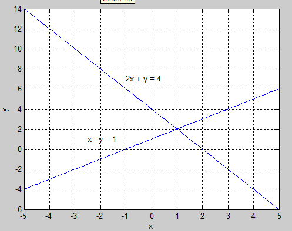


## Матричное решение: $X = A^{-1}b$

$$
\begin{array}{lll}
x - y &=& -1, \\ 
2 x + y &=& 4.
\end{array}
$$

```
A = [1 -1;
     2  1];
b = [-1; 4]; 

X = A \ b % левое деление


X =

     1
     2
```

