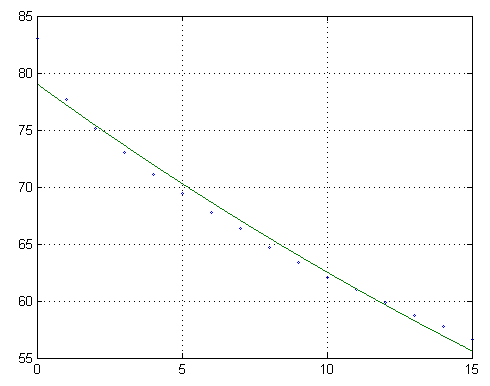
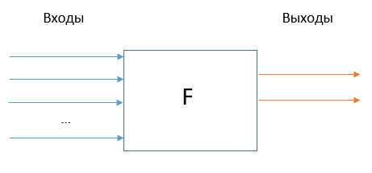
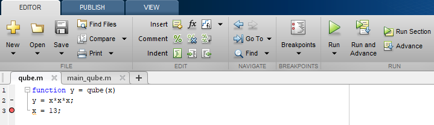
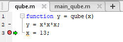
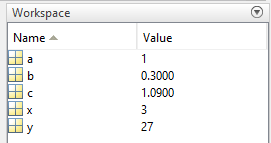
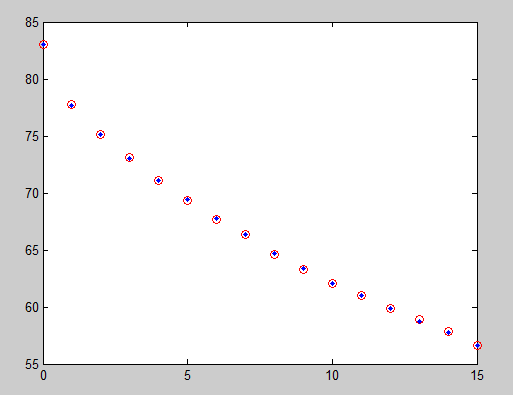

## В этой лекции

* Пример: моделирование остывания чашки кофе.
* Расширение возможностей языка: скрипты и функции.
* Функции: формальные и фактические параметры, локальные и глобальные переменные, контроль аргументов. 
* Ввод и вывод данных в Matlab.


## ПРИМЕР. Наблюдение за температурой кофе

t, мин. | T, $^\circ C$ | t, мин. | T, $^\circ C$ |
--------|--------|---------|--------|
0       | 83.0   | 8       | 64.7   |
1       | 77.7   | 9       | 63.4   |
2       | 75.1   | 10      | 62.1   |
3       | 73.0   | 11      | 61.0   |
4       | 71.1   | 12      | 59.9   |
5       | 69.4   | 13      | 58.7   |
6       | 67.8   | 14      | 57.8   |
7       | 66.4   | 15      | 56.6   |

Необходимо найти функцию $T = f(t)$, наилучшим образом приближающую экспериментальные данные $T_i$.


##




## Постановка задачи

Необходимо найти функцию *заданного вида*
$$
y = F(x)
$$
которая в точках $x_1, x_2, \ldots, x_n$ (моменты времени) принимает значения как можно более близкие к табличным $y_1, y_2, \ldots, y_n$ (температура).

Обычно используют функции:

* $a_0 + a_1 x + a_2 x^2 + \ldots + a_2 x^n$
* $\sin(x)$, $\cos(x)$
* $\exp(x)$, $\log(x)$
* ...

Если задать $y = a_0 + a_1 x$, то нужно найти $a_0$ и $a_1$.


## Метрика качества приближения

Приближающая функция $F(x)$ в точках $x_1, x_2, \ldots, x_n$ имеет значения:
$$
f_1, f_2, \ldots, f_n
$$
Расстояние между соответствующими точками таблицы и приближающей функции должно быть наименьшим:
$$
\sqrt{(y_1-f_1)^2 + (y_2-f_2)^2 + \ldots + (y_n-f_n)^2} \rightarrow \min
$$


Функция потерь (loss function):

$$
L(f_1, f_2, \ldots, f_n) = \sqrt{\sum_{i=1}^n (y_i-f_i)^2}
$$


## Линейная аппроксимация

$$
F(x) = a + bx
$$
Нужно подобрать $a$ и $b$ так, чтобы сумма квадратов отклонений точек $f_i$ от наблюдаемых значений $y_i$ была минимальной.
$$
L(a,b) = \sum_{i=1}^n (y_i - f(x_i,a,b))^2 \rightarrow \min
$$

Мы для приближения табличных данных будем использовать функцию
$$
f(x) = e^{a+bx}
$$
а работать -- с функцией
$$
\varphi(x) = \ln(f(x)) = a+bx
$$


## Необходимое условие экстремума

\bcols
\column{.5\textwidth}

\column{.5\textwidth}
В нашем случае $L(a,b) \rightarrow \min$ при условии:

$$
\frac{\partial L}{\partial a} = \frac{\partial L}{\partial b} = 0 .
$$
\ecols


## Найдем значения $a$ и $b$, обращающие $L(a,b)$ в минимум

\small

$$
L(a,b) = \sum_{i=1}^n (y_i - f_i)^2 \rightarrow \min
$$
По правилу дифференцирования сложной функции
\begin{align*}
\frac{\partial L}{\partial a} &= 2\sum_{i=1}^n (y_i - (a + bx_i))\frac{\partial f}{\partial a} = 0, \\
\frac{\partial L}{\partial b} &= 2\sum_{i=1}^n (y_i - (a + bx_i))\frac{\partial f}{\partial b} = 0.
\end{align*}

Вычислим производные $f = a + bx$ по $a$ и $b$:
$$
\frac{\partial f}{\partial a} = 1, \quad
\frac{\partial f}{\partial b} = x.
$$


##

\small

Получим
\begin{align*}
\sum_{i=1}^n (y_i - (a + bx_i)) &= 0, \\
\sum_{i=1}^n (y_i - (a + bx_i))x_i &= 0.
\end{align*}

Вычислим суммы
\begin{align*}
\sum_{i=1}^n y_i - an - b\sum_{i=1}^n x_i &= 0, \\
\sum_{i=1}^n y_i x_i - a\sum_{i=1}^n x_i - b \sum_{i=1}^n x_i^2 &= 0.
\end{align*}


##

Разделим уравнения на $n$
\begin{align*}
 a + \left({\frac{1}{n}\sum_{i=1}^n x_i }\right) b &= \frac{1}{n}\sum_{i=1}^n y_i, \\
\left({\frac{1}{n}\sum_{i=1}^n x_i }\right) a + \left({\frac{1}{n}\sum_{i=1}^n x_i^2 }\right) b &= \frac{1}{n}\sum_{i=1}^n y_i x_i.
\end{align*}

Введем обозначения
$$
M_x = \frac{1}{n}\sum x_i , \quad M_y = \frac{1}{n}\sum y_i,
$$
$$
M_{x^2} = \frac{1}{n}\sum x_i^2 , \quad M_{xy} = \frac{1}{n}\sum_{i=1}^n y_i x_i
$$


##

Перепишем систему уравнений с помощью новых обозначений
\begin{align*}
a + M_x \cdot b &= M_y, \\
M_x \cdot a + M_{x^2} \cdot b &= M_{xy}.
\end{align*}

Запишем систему уравнений в матричном виде

$$
\left[{
\begin{array}{ll}
1 & M_x \\
M_x & M_{x^2}
\end{array}
}\right]
\left[{
\begin{array}{l}
a \\
b \\
\end{array}
}\right] = 
\left[{
\begin{array}{l}
M_y \\
M_{xy}
\end{array}
}\right]
$$
или
$$
A X = B
$$

## Та-даа-м!

Решим систему
$$
X = A^{-1}B
$$

и получим формулу для вычисления коэффициентов $a$ и $b$
$$
\left[{
\begin{array}{l}
a \\
b \\
\end{array}
}\right] =
{\left[{
\begin{array}{ll}
1 & M_x \\
M_x & M_{x^2}
\end{array}
}\right]}^{-1}
\left[{
\begin{array}{l}
M_y \\
M_{xy}
\end{array}
}\right]
$$


## Код

```
% Ввод данных
x = 0:15;           % моменты времени
y = [83, 77.7, ...] % температура

y1 = log(y);
% Вычисление элементов матрицы системы
n = length(x);
Mx = sum(x)/n;
My = sum(y1)/n;
Mx2 = sum(x.^2)/n;
Mxy = x*y1'/n;
% Задание матрицы системы
M = [1 Mx; Mx Mx2];
% Задание столбца свободных членов системы
d = [My; Mxy];
% Решение системы линейных уравнений
s = M\d;
```


## Аппроксимация и ее погрешность

Коэффициенты линейной аппроксимации: `s = [4.3704 -0.0234]`.

Подставим их в $\varphi(t)$ и получим
$$
\varphi(t) = a + bt = 4.3704 - 0.0234t
$$

Потенцируем $\varphi(t)$ и получим аппроксимирующую функцию

$$
f = e^{\varphi(t)} = e^{4.3704 - 0.0234t}
$$

Оценим погрешность аппроксимации
```
f = exp( s(1)+s(2)*x );
err = sqrt(sum((y-f).^2));
```
```
>> err = 4.7362
```


## Схема решения задачи аппроксимации

\Large

1. Вводим данные.
2. Задаемся видом аппроксимирующей функции.
3. Определяем неизвестные параметры этой функции.
4. Оцениваем погрешность аппроксимации.


## Функции для интерполяции

\Large

* `polyfit` — вычисляет коэффициенты аппроксимирующего полинома n-й степени;
* `polyval` — вычисляет значения этого полинома в заданных точках.


## polyfit

```
p = polyfit(x, y, n)
```
Находит коэффициенты полинома $p(x)$ степени $n$
$$
p(x) = p_1 x^n + p_2 x^{n-1} + \ldots + p_n x + p_{n+1}
$$

который приближает функцию $y(x)$ методом наименьших квадратов. 

**Ввод:** `x`, `y` — табличные значения независимой переменной и функции, `n` — степень полинома.

**Вывод:** вектор `p` длины `n+1`, содержащий коэффициенты полинома $p(x)$.


## polyval

```
y = polyval(p, x)
```

**Ввод:** `p = [p1 p2 ... pn pn+1]` — вектор коэффициентов аппроксимирующего полинома, полученный с помощью `polyfit`,`x` — вектор значений независимой переменной, в которых нужно вычислить полином.

**Вывод:** `y` — вычисленные значения аппроксимирующего полинома.


## ПРИМЕР. polyfit и polyval в задаче об остывании кофе

\small

```
% Ввод данных
x = 0:15;           % моменты времени
y = [83, 77.7, ...] % температура

y1 = log(y); 

% Вычислим вектор коэффициентов линейного полинома
p = polyfit(x,y1,1);
% Задание дискретных значений независимой переменной
t = 0:0.01:x(end);
% Вычисление аппроксимирующего полинома
y2 = polyval(p,t);
T = exp(y2);
```

Коэффициенты аппроксимации: `p = [-0.0234 4.3704]`   

Аппроксимирующий полином: $p(x) = -0.0234 x + 4.3704$


## Расширение возможностей языка: скрипты и функции 

Возникает необходимость многократного использование одних и тех же фрагментов кода — создаем скрипты (программы). 

Если код получается универсальным и нужен в разных программах — создаем подпрограммы.

**Подпрограмма** — поименованная часть компьютерной программы, содержащая описание определённого набора действий. Подпрограмма может быть многократно вызвана из разных частей программы и разных программ.


## Сохранение фрагмента скрипта в отдельном файле

\bcols
\begin{column}{0.5\textwidth}
\includegraphics[width=\textwidth]{images/scripts1.png}
\end{column}
\begin{column}{0.5\textwidth}
\includegraphics[width=0.95\textwidth]{images/scripts2.png}
\end{column}
\ecols

Это не функция!

**Проблема:** недостаточная изоляция от остальной программы.


## Функции




## Синтаксис функций

```
function [y1,...,yN] = myfun(x1,...,xM)
% Что делает эта функция.
% x1 – массив входных параметров;
% ...
% y1 – массив выходных параметров;
...
% yN – массив выходных параметров.

команды (тело функции)
````

* `myfun` -- имя функции.
* Сохраняется в файле `myfun.m`. *НИКАКОЙ КИРИЛЛИЦЫ В ИМЕНАХ!*
* Функции, сохраняемые в m-файлах, называют **m-функциями**.
* Хороший стиль: писать комментарии к функциям.
* Функции одной переменной: `function Y = myfun(X)`.


## А как же end?

* Не ошибетесь, если поставите.
* Обязателен, если функция находится в m-файле не одна. Например, при использовании субфункций.

Файл `stat2.m`:

```
function [m,s] = stat2(x)
n = length(x);
m = avg(x,n);
s = sqrt(sum((x-m).^2/n));
end

function m = avg(x,n)
m = sum(x)/n;
end
```

\tiny

*Источник:* https://se.mathworks.com/help/matlab/ref/function.html


## Формальные и фактические параметры функций

* Пространство имен скрипта и функции.
* Передача данных в функции выполняется **по значению**.
* Помните про соответствие типов параметров!
* Какой еще способ передачи параметров в функцию вы знаете?

Основной скрипт:
```
x = 3;
y = qube(x)
```

Функция qube:
```
function y = qube(x)
y = x*x*x;
x = 13;
```


## Точка останова (breakpoint)




## Запускаем основной скрипт, срабатывает точка останова




У каждой функции своя область памяти (пространство имен). Мы находимся в пространстве имен функции `qube`.


## Делаем еще один шаг

Меню отладки


Жмем Step:


## Возвращаемся в основной скрипт

Снова Step или Continue:




## Глобальные переменные

* Объявление `global` размещается в начале программы/функции.
* Задается в программах и в функциях, использующих общие глобальные переменные.

```
global x y z
% определяет переменные x,y,z как глобальные. БЕЗ ЗАПЯТЫХ!
```

* Риски: «несанкционированное» изменение глобальной переменной изнутри функции. 
* Проверка: `isglobal(x)`


## ПРИМЕР. Работа с глобальными переменными

\small

Функция-"задаватель" значения глобальной переменной:
```
function setGlobalx(val)
global x
x = val;
```

Функция-получатель значения глобальной переменной:
```
function r = getGlobalx
global x
r = x;
```

Результат:
```
setGlobalx(328)
r = getGlobalx
r =

        328
```


## Объединение набора скалярных параметров в массив

Массив параметров — борьба с «перенаселенностью» списка аргументов функции.

Вместо:

```
function Y = transform(x,y,alpha,...)
```

делаем:

```
pars = [x,y,alpha,...];

function Y = transform(pars)
x = pars(1); y = pars(2); alpha = pars(3); …
…действия
```


## Анонимные функции или функции-однострочники

Синтаксис:

```
myfun = @(x,y,z,...) выражение
```

Пример:

```
sqr = @(x) x.^2;
sqr(2)


ans =

     4      
```


## Отладка функций

Основная ошибка при создании функций происходит при передаче данных. Поэтому

1. Проверьте правильность работы нужного фрагмента внутри программы, а затем выносите его в отдельную функцию. 
2. Проверьте правильность передачи параметров в функцию (выведите только что переданные параметры на экран). 

Тестируйте на маленьком примере, а затем переносите в большую программу.


## Контроль аргументов функции

```
function y = pwfun(x)
% вычисляет значения функции
%     | 1-sin(x), x<-pi,
% y = | x,       -pi<=x<0,
%     | cos(2*x), x>=0.
% использование: y = pwfun(x), x - число
if x < -pi
    y = 1-sin(x);
elseif x >= -pi & x <0
    y = x;
else
    y = cos(2*x);
end
```

Что произойдет, если мы наберем `pwfun('s')` или если вместо скалярного аргумента будет использован массив?


## Добавим проверку

```
function y = pwfun(x)
if ~isnumeric(x) | ~isscalar(x)
    error('x - скаляр числового типа')
end
...
```

* `isnumeric` возвращает 1, если аргумент относится к одному из числовых типов данных.
* `isscalar` возвращает 1, если аргумент скалярный. 
* `error()` останавливает выполнение скрипта и возвращает сообщение об ошибке. error не даст никакого эффекта, если строка с сообщением об ошибке будет пустой.


## Предупреждения

Можно убедиться, что переменная `x` не относится к `NaN` или `inf`. 

В этом случае функция вернет значение `NaN` или `inf`, но пользователя стоит предупредить, что со значением `x` что-то не так.

Добавим:

```
if isnan(x) | isinf(x)
    warning('Аргумент – NaN или inf');
end
```

* `warning()` выдает предупреждение, но продолжает выполнение программы.
* `isnan` и `isinf` — проверка на принадлежность к NaN или к бесконечностям.


## Файлы: определения

* Файл – именованный набор данных.
* Все файлы – бинарные "в глубине души".
* Текстовый файл: строки, разделенные признаком конца строки (CR+LF в Win).

**Что такое «Возврат каретки» (CR -- Carriage Return) и «Перевод строки» (LF -- Line Feed)?**


## Ввод/вывод числовых данных из текстовых файлов

`dlmread/dlmwrite` — чтение/запись числовых данных из текстового файла с произвольным разделителем данных.

```
M = dlmread('имя','разделитель')
```

Разделитель — символ, разделяющий данные в строке: пробел (по умолчанию), запятая, табуляция (`'\t'`).

```
dlmwrite('file.txt',M,'разделитель') 
```

Матрица `M` записывается в файл `file.txt` с использованием заданного разделителя.


## Примеры

Построение графика по данным из файла:

```
Файл data.txt
-------------
0 1
1 2
…
-------------

M = dlmread('c:/temp/data.txt')
plot(M(:,1),M(:,2))
```

Запись строки в файл:

```
M = 'arozaupalanalapuazora';
dlmwrite('c:/temp/data.txt', M, ',')
```

Записывает в файл матрицу M, разделителем является пробел.


## ПРИМЕР. Импорт данных с заголовками

\small

```
weekly.txt:

Sunday  Monday  Tuesday  Wednesday  Thursday  Friday  Saturday
95.01   76.21   61.54    40.57       55.79    70.28   81.53
73.11   45.65   79.19    93.55       75.29    69.87   74.68
60.68   41.85   92.18    91.69       81.32    90.38   74.51
48.60   82.14   73.82    41.03       0.99     67.22   93.18
89.13   44.47   57.63    89.36       13.89    19.88   46.60
```
```
dat = dlmread('weekly.txt');
```

Выдает ошибку:
```
Error using dlmread (line ...)
Mismatch between file and format string.
```
Данные имеют разный тип и разные разделители (2 и 4 пробела).


##

```
M = dlmread('file.txt', 'разделитель', R, C)
```
`R`, `C` — номер строки и колонки, с которых начинается чтение данных. **Нумерация начинается с 0.**

```
% Читаем данные, начиная со 2-й строки
dat = dlmread('weekly.txt',' ',1,0);
% Удаляем колонки, состоящие из одних нулей
dat = dat(:,sum(dat)~=0);
```

Имена колонок пропадают.


##

Функция `importdata` в современных версиях MATLAB импортирует числовые данные и заголовки в единую структуру.

```
>> dat = importdata('weekly.txt');
>> class(dat)

ans =

struct

>> fieldnames(dat)

ans = 

    'data'
    'textdata'
    'colheaders'
```


##

\footnotesize

```
>> dat.data

ans =

   95.0100   76.2100   61.5400   40.5700   55.7900   70.2800   81.5300
   73.1100   45.6500   79.1900   93.5500   75.2900   69.8700   74.6800
   60.6800   41.8500   92.1800   91.6900   81.3200   90.3800   74.5100
   48.6000   82.1400   73.8200   41.0300    0.9900   67.2200   93.1800
   89.1300   44.4700   57.6300   89.3600   13.8900   19.8800   46.6000

>> dat.colheaders

ans = 

    'Sunday'    'Monday'    'Tuesday'    'Wednesday'    'Thursday'
    'Friday'    'Saturday'   
```


## Функции ввода/вывода: «всё в одном»

* `csvread/csvwrite` — чтение/запись ASCII-данных из текстового файла с разделителем-запятой (CSV -- comma separated values);
* `imread/imwrite` — графические файлы;
* `wavread/wavwrite` — аудиофайлы;
* `aviread/movie2avi` — видеофайлы;
* `xlsread/xlswrite` — файлы Microsoft Excel.


## Ввод/вывод: общий случай

**Порядок работы:**

1. открытие файла;
2. чтение/запись;
3. закрытие файла.

**Открытие/закрытие файла:**

`fid = fopen('имя','доступ')` — открывает файл и заносит идентификатор файла в переменную `fid`. Дальше мы работаем только со значением `fid`.

`status = fclose(fid)` — закрытие файла (в status заносятся сообщения о возможных ошибках).


## Доступ к файлу

|      |                                              |  
|------|----------------------------------------------|
|'rt'  | открывает текстовый файл для чтения          |
|'rt+' | открывает текстовый файл для чтения и записи |
|'wt'	 | создает пустой текстовый файл для записи     |
|'wt+' | создает пустой текстовый файл для чтения и записи |
|'at'	 | открывает текстовый файл для добавления информации в конец (если файла нет, он создается) |
|'at+' | открывает текстовый файл для добавления информации в конец или чтения |

Откроем текстовый файл `data.txt` для чтения: 

```
fid = fopen('c:/temp/data.txt', 'rt')
```


## Чтение содержимого файла.

* `feof(fid)` — признак конца файла. `feof = 1`, если в файле больше нет строк и 0 в противоположном случае.
* `fgetl(fid)` — получение строки текстового файла с идентификатором `fid` без символа перевода строки.

```
f = fopen('c:/temp/data.txt','rt');
tfile = ''; % вначале массив строк пустой
while feof(f) == 0
    line = fgetl(f);
    tfile = char(tfile,line); % заносит line в массив строк
end
fclose(f);
disp(tfile)
```


## Массив строк: char

`char(‘строка1’, ‘строка2’, ‘строка3’,...)` — возвращает массив строк вида:

```
строка1
строка2
строка3
```

Строки могут быть разной длины, char их дополнит пробелами до максимальной строки.

```
S = char(‘a’, ‘abc’, ‘ab’)
	a  
	abc
	ab 
```	

Размерность `S`: 3x3.


## Форматный вывод в текстовый файл

```
fprintf(fid, 'формат', x, y, z)
```

`fid` — идентификатор, `x,y,z` — список выводимых переменных. 

`формат` — список форматов (шаблонов вывода), указывающих на то, как именно выводить массив:

* `%s` --	строка символов (до пробела)
* `%f` --	число с фиксированной точкой
* `%e` --	число в экспоненциальном представлении: `1000 = 1e3`
* `%c` --	одиночный символ (в т.ч. пробел)

Форматы `\n`, `\t` служат для создания перехода на новую строку и добавления символа табуляции соответственно. 

Стандарт записи форматных строк: ANSI C.


## Ширина поля вывода

Можно задать максимальную ширину поля. 

Например `'%6.2f %12.8f'` будет выглядеть так:


* `%6.2f` — Всего 6 позиций, включая точку и знак числа. Из них 2 -- после точки.
* Затем, как и в формате, идет пробел.
* `%12.8f` — 12 позиций, 8 после точки.


## Вывод массивов

Если выводимые переменные — массивы, цикл для организации вывода не нужен.

Вывод массива осуществляется по столбцам. 

Создадим таблицу значений экспоненты в файле `exp.txt`:

```
x = 0:.1:1;
y = [x; exp(x)];
fid = fopen('exp.txt','wt');
fprintf(fid,'%6.2f %12.8f\n',y);
fclose(fid);
```

Получим:
```
  0.00   1.00000000
  0.10   1.10517092
...
```

## 

В строку формата можно помещать пробелы и обычный текст. 

Например:

```
fprintf(fid,'x = %6.2f exp(x) = %12.8f\n',y);
```

дает в `exp.txt`

```
x =   0.00 exp(x) =   1.00000000
x =   0.10 exp(x) =   1.10517092
```


## Форматный ввод: textscan

Удобно использовать, когда известен формат считываемого файла.

```
fid = fopen('файл');
C = textscan(fid, 'формат');
fclose(fid);
```

Тип каждого аргумента определяется строкой `формат`. Если эта строка пуста, будут считываться только числовые данные.


## ПРИМЕР. Чтение форматированных данных

Файл `data.txt` содержит данные:

```
Vasja    12.34 45 Yes
Fedja    23.54 60 No
Nikodim  34.90 12 No
```

Считаем их

```
fid = fopen('data.txt');
C = textscan(fid,'%s%f%d%s');
fclose(fid);
```
```
class(C)

  cell % ячейка
```


##

```
for i = 1:4, disp(C{1,i}), end

    'Vasja'
    'Fedja'
    'Nikodim'

   12.3400
   23.5400
   34.9000

          45
          60
          12

    'Yes'
    'No'
    'No'
```


## Интерактивный ввод данных

**Ввод текстовых данных:**

```
A = input('Текст приглашения')
```

В CW появится строка с текстом приглашения. Пользователь вводит значение, которое сохранится в массиве A и жмет *Enter*.

**Ввод графических данных с помощью мыши:**

```
[X,Y] = ginput(N)
```

Открывает графическое окно, в котором указателем мыши можно отметить координаты точек. Эти координаты сохранятся в массивах `X` и `Y`. `N` (необязательный аргумент) — максимальное число вводимых точек. В конце работы с `ginput` жмем *Enter*.


## БОНУС. Оцифровка данных из задачи об остывании кофе (`digitize_plot.m`)




## Операции над файлами

* Открыть файл: `open('foo.m')`
* Удалить файл: `delete(‘имя_файла’)` или `delete имя_файла`.
* Есть еще `save`, `saveas`, `print`, …
* Список файлов в каталоге: `dir('имя_каталога')`
* Создать каталог (внутри текущего): `mkdir('имя_каталога')`
* Сменить рабочий каталог: `cd('новый_каталог')`
* Показать текущий рабочий каталог: `pwd`
* Показать текст файла на экране: `type список_файлов`


## ПРИМЕР. Печать имен файлов из текущего каталога

`dir` без параметров возвращает список файлов текущего каталога.

\small

```
>> dir

.                coffee_poly.m    main_script.m    qube.m           xfileread2.m     
..               digitize_plot.m  main_script2.m   readxls.m        xpwfun.m         
anonymous.m      least_squares.m  problem01.m      squares.m        
coffee2.m        main_qube.m      pwfun.m          xfileread.m   
```

\normalsize

Код:

```
files = dir;
for i=1:length(files)
  disp(files(i));
end
```


## Если работу нужно прервать…

**Сохранение переменных из Workspace на диск.**

* `save имя_файла` — сохраняет все содержимое Workspace в бинарный mat-файл `имя_файла.mat`. Эта информация затем может быть загружена функцией `load`.
* `save имя_файла x,y,z,..` — будут сохранены только переменные `x,y,z,..` В именах переменных можно использовать шаблон `'*'`.

**Загрузка данных с диска в Workspace.**

* `load имя_файла` — загружает все переменные, сохраненные в файле `имя_файла`. Это может быть бинарный файл с таким именем и расширением `.mat` или текстовый файл (с любым расширением или без него).
* `load имя_файла x,y,z,..` — загрузит только переменные `x,y,z,..` Можно использовать `'*'`.
