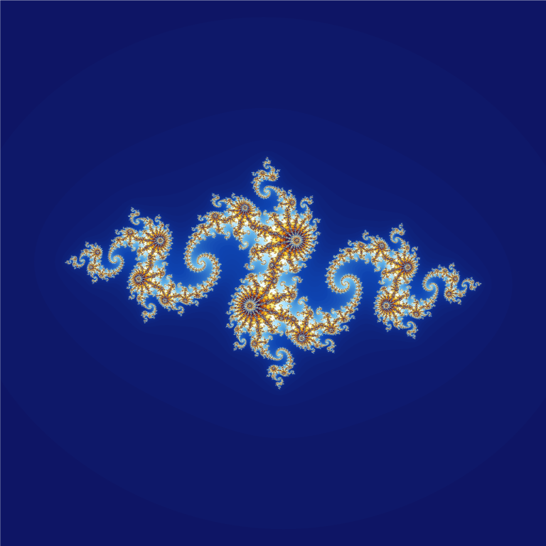
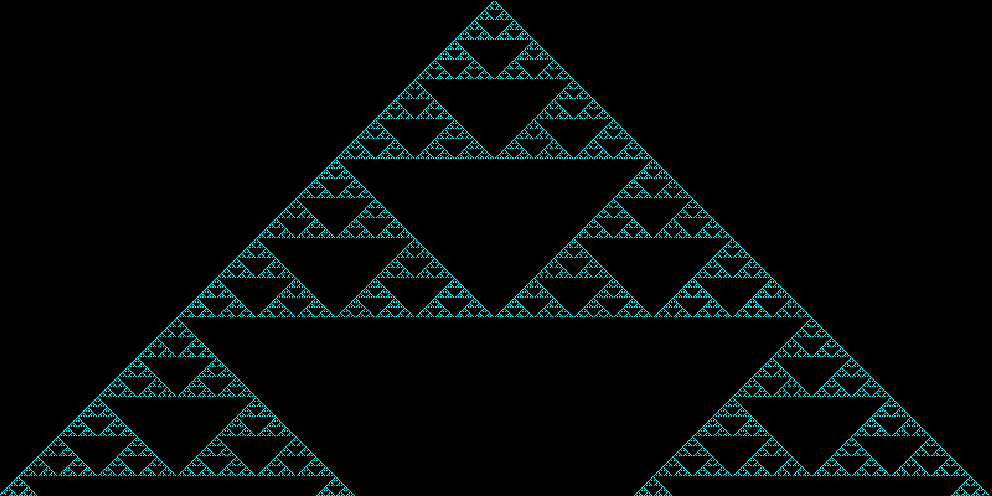
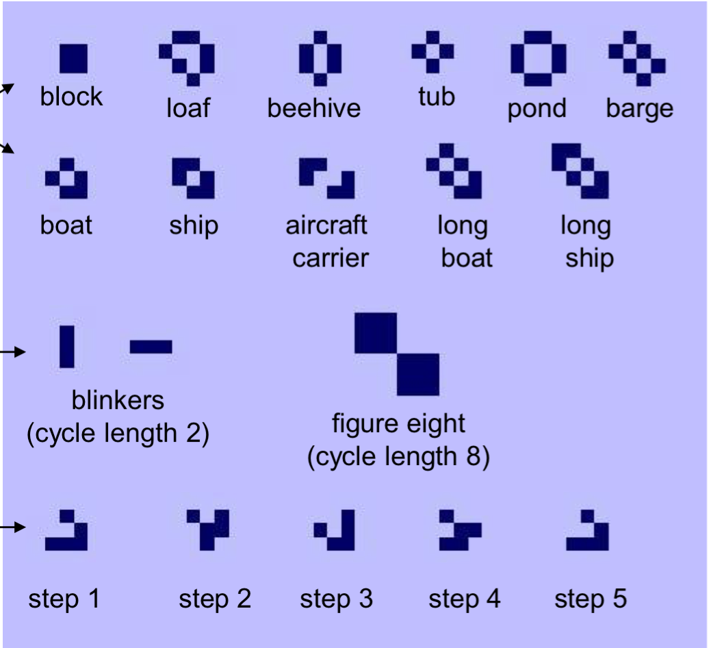

## В этой лекции

* Построение кривых и точек в пространстве.
* Построение графиков функций двух переменных: mesh и surf.
* Низкоуровневые графические функции. Управление свойствами графических объектов.
* Пример: множество Жюлиа.
* Пример: одномерный клеточный автомат.
* Пример: игра "Жизнь".


## Построение кривых и точек в пространстве

```
plot3(x,y,z)
```
`x`, `y` и `z` — векторы координат точек линии (равной длины): 
```
x = x(t), y = y(t),  z = z(t).
```

Функция `plot3` удобна для отображения точек данных. Нужно лишь поставить маркер «точка». Для этой же цели используется `scatter3`.


## ПРИМЕР. Винтовая линия

Винтовая линия -- растущая вверх окружность единичного радиуса.
 
```
t = 0:pi/50:10*pi;
plot3(sin(t),cos(t),t)
grid on
```

\begin{center}
\includegraphics[width=0.5\textwidth]{images/screw.png}
\end{center}


## ПРИМЕР. Построение графика единичной сферы с помощью окружностей

\bcols
\column{.5\textwidth}
```
n = 50; m = 50;
t1 = -pi:pi/n:pi;
t2 = [-pi/2:pi/m:pi/2]';
X = cos(t2)*cos(t1);
Y = cos(t2)*sin(t1);
E = ones(size(t1));
Z = sin(t2)*E;
plot3(X,Y,Z,'r.'), grid on 
title('Сфера'), axis square
```
\column{.5\textwidth}

\ecols


## Поверхность в пространстве

Задается функцией двух переменных: $z=f(x,y)$.

\begin{center}
\includegraphics[width=0.7\textwidth]{images/surface_ex2.png}
\end{center}

Каждой точке с координатами `x` и `y` соответствует «высота» `z` -- значение функции. 


## Как задать область определения функции

Чтобы построить график функции одной переменной $y=f(x)$, мы изменяли аргумент $x$ с заданным шагом $h$ и вычисляли соответствующие значения функции $y$.

В пространственном случае будем строить двумерную сетку: изменять значения аргументов $x$ и $y$ с постоянными шагами $h_x$, $h_y$ и вычислять соответствующие значения функции $z$.

Для простоты будем рассматривать только прямоугольные области определения.


## Область $0\le x \le 1$, $0\le y \le 1$, $h = 0.5$

\bcols
\column{.5\textwidth}
```
X =[0 0.5 1;
    0 0.5 1;
    0 0.5 1];

Y =[0   0   0;
    0.5 0.5 0.5;
    1   1   1];
```
\column{.5\textwidth}

\ecols

\small

Дано: `x = 0:0.5:1`, `y = 0:0.5:1`

Строки матрицы `X` состоят из копий вектора `x`. Число этих копий равно числу элементов в векторе `y`.

Cтолбцы `Y` представляют собой y-координаты узлов сетки. Число столбцов равно числу элементов вектора `x`. 


## Формирование прямоугольной координатной сетки: meshgrid

Мы не можем записать `Z = x.^2 + y.^2`, поскольку `x = 0:0.5:1`, `y = 0:0.5:1` — одномерные массивы, а `Z` — двумерный (значения функции в узлах сетки). Для создания сетки понадобится специальная функция

```
[X,Y] = meshgrid(x, y)
```

`x`, `y` – векторы, задающие диапазоны изменения по осям Ox, Oy. `X`, `Y` — матрицы элементов сетки.

```
[X,Y] = meshgrid(0:1,0:1);
Z = X.^2 + Y.^2;  % поэлементное действие!
```

Как бы мы поступали, если бы `meshgrid` не было?


## Построение графиков функций двух переменных

График функции двух переменных -- это поверхность в пространстве.

Поверхности строятся с помощью:

* `mesh(X,Y,Z)` -- проволочный каркас поверхности.
* `surf(X,Y,Z)` –- грани, соединяющие ребра каркаса.

Каркас окрашен в зависимости от значения функции в данной точки. Например, большие значения функции окрашены в более теплые цвета (максимальное –- в ярко красный), меньшие –- в более холодные (наименьшее –- в синий).

Принцип раскраски граней тот же, что у каркаса.


## mesh

\bcols
\column{.5\textwidth}
```
[X,Y] = meshgrid(-8:.5:8);
R = sqrt(X.^2 + Y.^2) + eps;
Z = sin(R)./R;
mesh(X,Y,Z)
```
\column{.5\textwidth}

\ecols


## surf

\bcols
\column{.5\textwidth}
```
[X,Y] = meshgrid(-8:.5:8);
R = sqrt(X.^2 + Y.^2) + eps;
Z = sin(R)./R;
mesh(X,Y,Z)
```
\column{.5\textwidth}

\ecols


## Алгоритм построения графика функции двух переменных

\Large

1. Сгенерировать матрицы `X`,`Y` с координатами узлов сетки: `meshgrid`.
2. Вычислить значения функции в узлах сетки: `Z = f(X,Y)`.
3. Использовать одну из графических функций MATLAB: `surf`, `mesh`,...


## ПРИМЕР. Поиск максимума функции peaks и вывод его на график


##

\bcols
\column{.5\textwidth}
```
Z = peaks(100);
surf(Z), hold on
% Найдем максимум по столбцам
% и строкам
Zmax = max(max(Z));    
% Найдем индексы
% максимального элемента
[i,j] = find(Z==Zmax); 
% Отметим максимум 
% большой фиолетовой точкой
plot3(j,i,Z(i,j),'m.','MarkerSize',30)
```
\column{.5\textwidth}

\ecols

`i` и `j` — не координаты, а индексы максимального элемента массива, координаты же этого элемента: `x=j`, `y=i`.

Если данные распределены неравномерно, то вместо `meshgrid` используются `griddata` или `TriScatteredInterp` (в последних версиях MATLAB).


## Вспомогательные графические функции

Большинство вспомогательных функций, определяющих внешний вид графика в плоском случае, работают и в трехмерной графике. 

*	`axis` -- управление свойствами осей координат сохраняют свои свойства и в трехмерной графике. Добавляется третья ось координат:
`axis([xmin xmax ymin ymax zmin zmax])`
*	Для обозначения по оси z используется функция `zlabel`: `zlabel('строка')`

Существуют функции, специально предназначенные только для трехмерной графики. Например:

*	`hidden on/off` -- {включить}/выключить удаление невидимых линий.


## Высокоуровневые и низкоуровневые графические функции

Высокоуровневые графические функции `plot`, `surf`, `mesh` делают сразу несколько дел: 

1. строят графическое окно;
2. определяют параметры координатных осей; 
3. строят координатные оси;
4. строят кривую или поверхность, то есть собственно график. 

Все это можно сделать по частям с помощью **низкоуровневых графических функций**. Они позволяют создавать рисунки из отдельных объектов, как из кубиков. Такой подход гибче, а его результат работает быстрее, поскольку не задействованы избыточные возможности высокоуровневых функций.

**Примеры:**

* [Настраиваем графики в MATLAB](http://dkhramov.dp.ua/Sci.SetPlotSettingsMATLAB)
* [Многоцветная линия](http://dkhramov.dp.ua/Sci.MultiColoredLine)


## Иерархия графических классов


\scriptsize

1. `root` — соответствует экрану компьютера. В работе явно не используется.
2. `figure` (рисунок) — графическое окно.
3. В окне размещаются:
    * \scriptsize `axes` — координатные оси;
    * `UI*` — элементы пользовательского интерфейса (меню, кнопки и др.).
4. В осях координат располагаются
    * \scriptsize `line` — (линия) кривая графика функции одной переменной;
    * `text` — текстовая надпись;
    * `surface` — поверхность, являющаяся графиком функции двух переменных.


## Конструкторы объектов

`patch()` рисует многоугольник, закрашиваемый заданным цветом:
```
x = [0 1 2];
y = [0 1 0];
patch(x,y,'r')
```
Названия функций-конструкторов обычно совпадают с названиями создаваемых ими графических объектов.


## Указатели объектов

Как отличить один графический объект от другого?

Создадим объект `figure` (графическое окно):
```
h = figure;
```

`h` — указывает на этот объект. Во всех операциях с данным окном мы будем использовать этот указатель. Если это первое открытое графическое окно, то `h = 1`.

Создадим новое окно, не закрывая первого:
```
p = figure;
```

`p = 2`. Указатель объектов `figure` — целое число, номер графического окна.


##

Указатель — это то, с помощью чего MATLAB отличает один объект от другого. Можно воспринимать указатель как имя объекта или как ссылку на объект.

Указатель (дескриптор) -- не совсем удачный перевод термина "handle" — титул, прозвище, кличка. 

Другой способ указать на объект — понятие "текущего" или "активного" объекта: `gcf`, `gca`, `gco`.


## Получение свойств объекта: `get(h)`

\bcols
\column{.5\textwidth}
Построим график из отрезков линии красного цвета:
```
h = line([0 2 5],[1 4 -1], ...
         'Color','r')

  h = 
      3.0017
```
\column{.5\textwidth}

\ecols

Объект `line` имеет указатель `h`. Узнать свойства этого объекта можно так:

```
get(h)
```


## Свойства line

\tiny

```
	DisplayName = 
	Annotation = [ (1 by 1) hg.Annotation array]
	Color = [1 0 0]
	LineStyle = -
	LineWidth = [0.5]
	Marker = none
	MarkerSize = [6]
	MarkerEdgeColor = auto
	MarkerFaceColor = none
	XData = [0 2 5]
	YData = [1 4 -1]
	ZData = []

	BeingDeleted = off
	ButtonDownFcn = 
	Children = []
	Clipping = on
	CreateFcn = 
	DeleteFcn = 
	BusyAction = queue
	HandleVisibility = on
	HitTest = on
	Interruptible = on
	Parent = [174.007]
	Selected = off
	SelectionHighlight = on
	Tag = 
	Type = line
	UIContextMenu = []
	UserData = []
	Visible = on
```


## Установка свойств объекта: `set(h)`

\small

\bcols
\column{.5\textwidth}
Изменить свойства объекта позволяет функция `set`:
```
set(h, 'Color', [0 1 0])
% Вместо [0 1 0] 
% можно указать 'g' или 'green'.
```

Общий вид функции: 

```
set(h, 'Свойство', значение)
```

\column{.5\textwidth}

\ecols

Низкоуровневые графические функции позволяют управлять тонкими свойствами графических объектов, которые нельзя изменить с помощью функций высокого уровня:
```
set(h, 'LineWidth', 1)
set(h, 'FontSize', 12)
```


## Удаление объекта: `delete(h)`


## ПРИМЕР. Динамический график

```
%% Статический график

n = 1000;
x = linspace(0,50,n); y = exp(-0.1*x).*sin(x);
plot(x,y)
% Возьмем пределы из готового графика.
limits = get(gca, {'XLim', 'YLim'});
celldisp(limits)

  limits{1} =
     0    50

  limits{2} =
 
   -0.8000    1.0000
```


##

```
%% Динамический график

figure; grid on;
set(gca,'XLim',limits{1},'YLim',limits{2});
h = line([x(1),x(1)],[y(1),y(1)],'EraseMode','none');

for i=2:n
    set(h,'XData',[x(i-1),x(i)],'YData',[y(i-1),y(i)]);
    drawnow;
    %pause(1e-6);
end
set(h,'XData',x,'YData',y)

%% Закрыть все окна графиков
%close all
```


##


## Чтение/запись изображения

Команда

```
A = imread(filename, fmt)
```
читает изображение из файла с `filename` и помещает его в массив A. 

Формат файла `fmt` при вызове функции может быть опущен, тогда формат определяется из содержимого файла.

**Вместо `filename` можно указать `URL`.**

Запись изображения в файл:

```
imwrite(A, filename, fmt)
```


##

Любой цвет задается смесью красного (Red), зеленого (Green) и синего (Blue) цветов. 

Интенсивности пикселей цветного изображения хранятся в трехмерном массиве I(M,N,3). 

M, N – количество пикселей по X и Y.

Каждый пиксел (i,j) цветного изображения характеризуется тремя числами: 

* I(i,j,1) -- интенсивностью красного цвета, 
* I(i,j,2) -- интенсивностью зеленого цвета и 
* I(i,j,3) -- интенсивностью синего цвета.

Интенсивность -- положительное целое число: `uint*`.


## ПРИМЕР. Вывод информации об изображении

\small

\bcols
\column{.5\textwidth}
```
A = imread('../images/lenna.png');
imshow(A);
imfinfo('../images/lenna.png')
```

\footnotesize

```
Filename: 'D:\км\images\lenna.png'
FileModDate: '08-Mar-2019 09:58:08'
FileSize: 473831
Format: 'png'
Width: 512
Height: 512
BitDepth: 24
ColorType: 'truecolor'
```
\column{.5\textwidth}

\ecols

* `imshow(filename)`, `imshow(A)` — вывод изображения на экран.
* `imfinfo(filename, fmt)`  — информация об изображении: дата создания,	размер,	формат,	метод кодирования, глубина цветопередачи, ...


## Прозрачность: alpha

\small

\bcols
\column{.5\textwidth}
```
A = imread('../images/lenna.png');

subplot(2,2,1); 
imshow(A); 
title('Original, alpha = 1');

subplot(2,2,2); 
h = imshow(A); alpha(h,0.8); 
title('alpha = 0.8');

subplot(2,2,3); 
alpha(imshow(A),0.5); 
title('alpha = 0.5');

subplot(2,2,4); 
alpha(imshow(A),0.2); 
title('alpha = 0.2');
```
\column{.5\textwidth}

\ecols


## ПРИМЕР. Фракталы. Множество Жюлиа

**Фрактал** — это объект (например, кривая), обладающий свойством самоподобия. Понятие ввел Бенуа Мандельброт.

Фракталы обнаружились при измерении рек и границ. 

Длина государственной границы между Испанией и Португалией в справочниках этих стран какое-то время отличалась на 20% (Испания насчитала 616 миль, а Португалия 758 миль). Оказалось, что страны измеряли протяженность границы разными "линейками". Короткая "линейка" позволяла учитывать мелкие детали, что в итоге и дало 20% разницы. 

Был некоторый скандал, а потом разобрались, что во всем виноваты фракталы. 
\tiny

*Источник:* http://paulscottinfo.ipage.com/fractals-in-nature/3/F2.spain-portugal-border.html


## Множество Жюлиа

Гастон Жюлиа, лежа в больнице после ранения, развлекался вычислением последовательности
$$
Z_{n+1} = Z_{n}^2 + C .
$$

Оказалось, что после нескольких итераций точки либо остаются в ограниченной области, либо "убегают" на бесконечность. 


## Остающиеся точки


##

Было доказано, что как только выполняется $|Z_n| \ge 2$, то последовательность стремится к бесконечности. 

Проверка этого свойства позволяет выделять точки, не попадающие внутрь множества.

Напрашивается алгоритм:

1) задаем кол-во итераций;
2) задаем исследуемую область;
3) задаем начальную точку C;
4) выполняем заданное число итераций для каждой точки области;
5) рисуем точки, которые остались в области.


##

```
iter = 30;   % кол-во итераций
npix = 1000; % размер изображения: npix х npix
% Область наблюдения
dl = 1.5;
x = linspace(-dl,+dl,npix);
y = linspace(-dl,+dl,npix);
[X,Y] = meshgrid(x,y);
Z = X + i*Y;
% Начальная точка
C = 0.27334-0.00742i;

B = zeros(npix);

for l = 1:iter
    Z = Z.^2 + C;       
    B = B + (abs(Z)<2);
end;

imagesc(B);
```


## C = -0.561321 + 0.64100i


## Wikipedia: Julia Set




## ПРИМЕР. Одномерный клеточный автомат

**Клеточный автомат** -- набор конечного числа элементов (клеток), образующих регулярную сетку. 

Каждая клетка находится в одном из конечного числа *состояний*. Например, 0 или 1. 

*Окрестность* клетки состоит из нее самой и соседних клеток. В одномерном КА под окрестностью клетки понимается она сама и ее соседи слева и справа.


##

Состояние клетки изменяется по шагам, в зависимости от состояния ее окрестности. 

Пусть текущее состояние всех клеток известно (задано). На следующем шаге состояние каждой клетки преобразуется по определенным правилам. Например, таким

111 |	110	| 101	| 100	| 011	| 010	| 001	| 000 |
----|-----|-----|-----|-----|-----|-----|-----|
0	  |   1	|   0	|   1	|   1	|  0 	|  1	|  0  |

Первая строка -- текущее состояние окрестности, вторая -- состояние центральной клетки на следующем шаге.

Первое правило (крайнее слева): если все клетки окрестности активны (1), то на следующем шаге центральная клетка пассивна (0).


##



Казалось бы, клеточные автоматы должны эволюционировать либо к простым пространственно-однородным состояниям, либо к периодическим структурам (на рисунке). Но это не так.


## Правило 30


## Код

\footnotesize

```
nx=720;  % должно делитьсЯ на 2
nt=nx/2;
 
z = zeros(nt,nx); 
C = z; 
c = zeros(1,nx);
c(nx/2) = 1; 
C(1,:) = c;
 
imh = image(cat(3,z,C,C)); 
set(imh, 'erasemode', 'none'); axis('equal','tight','off')

x = 2:nx-1;
for t=2:nt
    C(t,x) = (c(x-1)==1 & c(x)==1 & c(x+1)==0) | ...
             (c(x-1)==1 & c(x)==0 & c(x+1)==0) | ...
             (c(x-1)==0 & c(x)==1 & c(x+1)==1) | ...
             (c(x-1)==0 & c(x)==0 & c(x+1)==1); % sierpinsky   
    set(imh, 'cdata', cat(3,z,C,C) ) 
    drawnow 
    c = C(t,:);
end 
```


## БОНУС. Игра "Жизнь". Джон Конуэй, 1970 г.

Клетки игрового поля размечаются в начале игры как живые (1) или мертвые/пустые (0).

### Правила

1. Если у пустой клетки есть ровно 3 живых соседа, то на следующем ходу в ней происходит "рождение".
2. Если у живой клетки 2 или 3 живых соседа, то на следующем ходу она продолжает жить.
3. Если у живой клетки меньше 2 или больше 3 живых соседей, то на следующем ходу она умирает (одиночество или перенаселение).

Игрок не принимает непосредственного участия в игре, а лишь расставляет начальную конфигурацию "живых" клеток.


## Интересные конфигурации




## 

* Код: `source/life.m`.

 Много интересных комбинаций:

* [Math Battle in Game Of Life](https://www.youtube.com/watch?v=-FaqC4h5Ftg)

Можно собрать логические элементы типа И, ИЛИ и НЕ, а значит **создать эквивалент универсального компьютера внутри самой игры**.

* [Game of Life: Logic gates](https://www.youtube.com/watch?v=vGWGeund3eA) -- реализация логических вентилей И, ИЛИ, НЕ в игре "Жизнь".


## БОНУС. Комплексные корни полинома

Найдем корни полинома $x^4+2x^3+3x^2+4x+5$ и отобразим их на графике.

```
p = [1 2 3 4 5]; % коэффициенты полинома
r = roots(p)

r =

   0.2878 + 1.4161i
   0.2878 - 1.4161i
  -1.2878 + 0.8579i
  -1.2878 - 0.8579i
```


## Значения полинома на комплексной плоскости

```
% контурный график значений полинома
[X,Y] = meshgrid(linspace(-1.5,.5,100), ...
                 linspace(-1.5,1.5,100));
Z = X + 1i*Y;
Z1 = Z.^4 + 2*Z.^3 + 3*Z.^2 + 4*Z + 5;
[C,h] = contour(X,Y,Z1,20); hold on
clabel(C,h); % надписи на изолиниях

% добавляем корни на график
scatter(real(r),imag(r),'filled','red'), grid on
xlabel('Re(z)'),ylabel('Im(z)')
```


## contour и scatter (plot) на одном графике


## Ссылки

1. [Representing Data as a Surface - MATLAB & Simulink](https://se.mathworks.com/help/matlab/visualize/representing-a-matrix-as-a-surface.html) -- график поверхности, код примера построения графика `sinc`.
2. [MATLAB Plot Gallery](https://se.mathworks.com/products/matlab/plot-gallery.html) -- просто красивые и полезные примеры.
3. [Интересные конфигурации в игре "Жизнь"](https://neerc.ifmo.ru/wiki/images/7/7c/Types.png).

