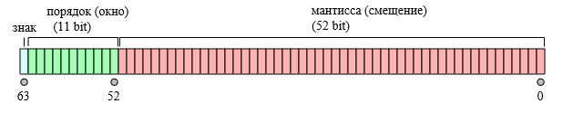
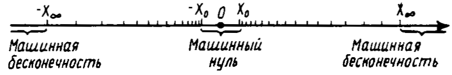
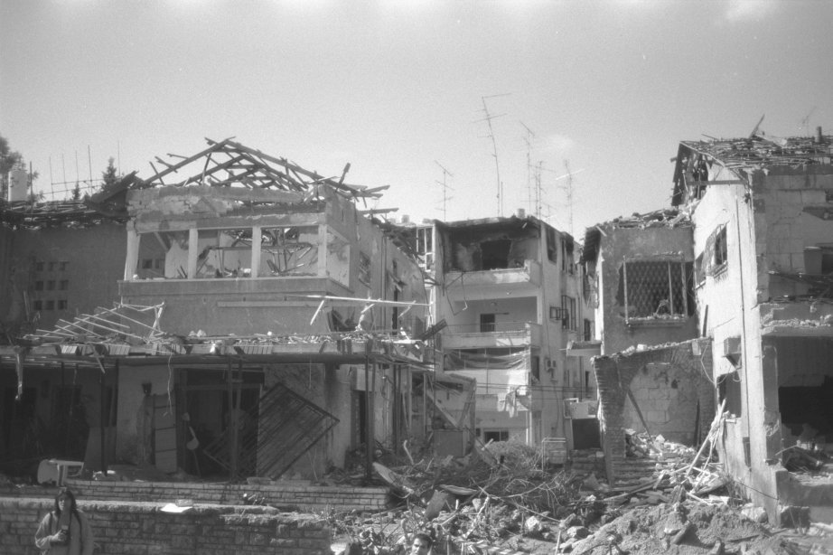
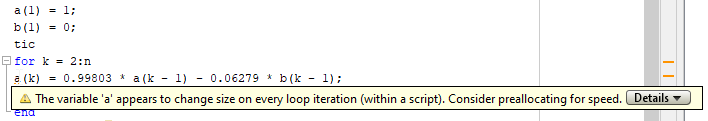
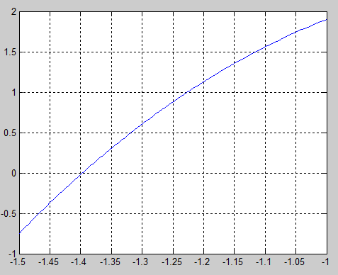

## Содержание

\footnotesize

* Компьютерная арифметика: что не так?
* Числа с плавающей точкой
* *Аппроксимация числа*
* Расстояние между соседними числами
* Следствия конечности разрядной сетки
* Машинный эпсилон
* *ПРК "Пэтриот", 25.02.1991 — ошибка при перехвате иракских ракет*
* *Ариан-5, 4.06.1996 — взрыв после 40 секунд полета*
* Погрешность вычислений
* Погрешности вычисления суммы и разности
* *Катастрофическая потеря точности при вычитании близких чисел одного знака*
* Неустранимые погрешности
* Погрешности вычислений и округления
* Резервирование памяти под массив
* Ускорение за счет памяти
* Роль оперативной памяти
* Разбиваем задачу на части
* "Правильные" типы данных
* Функции управления памятью
* Советы по эффективному программированию
* *Метод половинного деления*


## Компьютерная арифметика: что не так?

Значения функции на компьютере отличаются от принятых в математике:

$\cos\pi/2=0$, но `cos(pi/2) = 6.1232е-17`.

Результат суммирования зависит от порядка выполнения операций:
```
>> x = 0.1+(0.2+0.3);
>> y = (0.1+0.2)+0.3;
>> % x и y равны?
>> x==y

ans =
     0
```

**Математический объект $\ne$ Компьютерная реализация**


## Числа с плавающей точкой

Вещественные числа представляется в памяти компьютера в форме записи с *плавающей точкой*. 

Для хранения вещественного числа в памяти компьютера отводится поле стандартной длины — машинное слово длиной 64 бита. 


Конечная разрядная сетка для представления чисел на компьютере — источник отличий машинной арифметики от обычной.


##

\small

Запись числа с плавающей точкой похожа на экспоненциальную запись в математике:
$$
1045.86 \Rightarrow 0.104586 \cdot 10^4 \Rightarrow 104586E04
$$
До буквы *E* располагается *мантисса*, после — *порядок*.



Порядок (окно) сообщает нам, между какими двумя последовательными степенями двойки будет число: $[0,1]$, $[1,2]$, $[2,4]$, $[4,8]$, ..., $[2^{2047},2^{2048}]$.

Мантисса или смещение разделяет окно на $2^{53} = 9007199254740992$ сегментов. 

## ПРИМЕР. Аппроксимация числа 6.1

С помощью окна и смещения можно аппроксимировать число. 


## Расстояние между соседними числами

В окне $[0,1]$ $9007199254740992$ смещений накладываются на интервал размером 1, что дает нам точность 
$$
\frac{(1-0)}{9007199254740992} = 1.1102230246251565404236316680908e^{-16} .
$$

В окне $[2^{12},2^{13}]$ смещения накладываются на интервал размером $8192-4096 = 4096$, что дает нам точность 
$$
\frac{(8192-4096)}{9007199254740992} = 4,5474735088646411895751953125e^{-13} .
$$


В окне $[2^{127},2^{128}]$ смещения накладываются на интервал $2^{128} - 2^{127} \approx 1,7014e^{+38}$, что дает точность
$$
\frac{(2^{128} - 2^{127})}{9007199254740992} = 18889465931478580854784 .
$$


## Следствие 1. В компьютере представимо конечное подмножество рациональных чисел

В компьютере представимы не все числа, а лишь конечное подмножество рациональных чисел, "укладывающихся" в рамки машинного слова. Любое другое число будет представлено с ошибкой округления, не меньшей единицы самого младшего разряда мантиссы.

**Машинным эпсилоном** (машинной точностью, `eps`) называется наименьшее представимое в компьютере число $\varepsilon$, удовлетворяющее условию $1 + \varepsilon > 1$.

Машинный эпсилон характеризует наименьшую относительную погрешность вычислений и зависит от архитектуры компьютера и разрядности вычислений (single, double,...).
```
eps = 1; x = 1;
while x + eps > x, eps = eps/2, end
```


## Следствие 2. Диапазон изменения чисел в компьютере ограничен

Существует минимальное $X_0$ (`realmin`) и максимальное $X_\infty$ (`realmax`) числа, которые можно представить на данном компьютере.
```
>> realmin
ans =
    2.225073858507201e-308
>> realmax
ans =
    1.797693134862316e+308
```

* Числа, меньшие по модулю $X_0$ для машины не различимы и представляют собой **машинный нуль** ($X_0 \ll \varepsilon$). 
* Числа, большие $X_\infty$ рассматриваются как машинная **бесконечность** (`Inf`).
* Диапазон представления чисел на компьютере определяется разрядностью порядка.


## Следствие 3. Числа на "компьютерной" числовой прямой распределены неравномерно




## Резюме по машинной арифметике

\large

В машинной арифметике нарушаются правила обычной арифметики из-за конечности разрядной сетки компьютера.

Почти наверняка в представимом на компьютере множестве числе нет числа `у`, являющегося решением поставленной задачи. 

Лучшее, что можно попытаться сделать, — это найти его представление `у* = fl(у)` с относительной точностью порядка $\varepsilon$. 

Пока непонятно, чем это все нам грозит.


## ПРК "Пэтриот", 25.02.1991 — ошибка при перехвате иракских ракет

\small

Время измерялось системными часами в десятках секунд, а затем умножалось на 1/10 чтобы получить результат в секундах. Вычисление производились с 24-разрядными числами. 

1/10 — бесконечная двоичная дробь, которая обрезалась после 24-го разряда. Появлялась ошибка округления, из-за которой батарея противоракет, находившаяся на боевом дежурстве около 100 часов, накапливала погрешность в определении времени в 0.34 с.

Ракета "Scud" (Р-17) летит со скоростью около 1676 м/с и за 0.34 с. пролетает около 0.5 километра. В итоге система ПРО не реагировала на подлетающую ракету, считая что та находится за пределами охраняемого участка.

\scriptsize

**Источник:** http://www-users.math.umn.edu/~arnold/disasters/patriot.html


## Проверим?

Что будет, если сравнить

```
0.3 == 0.3
```

А это?

```
0.4 - 0.1 == 0.3
```


## Что подлетало: Р-17


## Куда прилетело




## Ариан-5, 4.06.1996 — взрыв после 40 секунд полета

The rocket was on its first voyage, after a decade of development costing \$7 billion. The destroyed rocket and its cargo were valued at \$500 million. The cause of the failure was a software error in the inertial reference system. Specifically a 64 bit floating point number relating to the horizontal velocity of the rocket with respect to the platform was converted to a 16 bit signed integer. The number was larger than 32768, the largest integer storeable in a 16 bit signed integer, and thus the conversion failed.

\scriptsize

**Источник:** http://www-users.math.umn.edu/~arnold/disasters/ariane.html


## Boeing CST-100 Starliner, 20.12.2019 — никогда такого не было, и вот опять

После того, как CST-100 успешно отделился от ракеты-носителя, произошёл непредвиденный сбой в системе расчёта полётного времени корабля. В результате было израсходовано много топлива, нужного для планировавшейся на следующий день стыковки с МКС. В итоге, было принято решение отменить стыковку корабля с МКС и попытаться вывести корабль Starliner на орбиту, которая позволила ему вернуться на Землю в течение 48 часов.

\scriptsize

**Источник:** https://ru.wikipedia.org/wiki/CST-100_Starliner


## Погрешность вычислений

* $a$ — точное значение, вообще говоря, неизвестное;
* $a^\ast$ — известное приближенное значение.

**Абсолютная погрешность**  (absolute tolerance)
$$
\Delta (a^\ast) = |a-a^\ast| .
$$ 

Чтобы охарактеризовать точность, абсолютной погрешности недостаточно. Погрешность нужно сопоставлять со значением измеряемой величины.

<!--Погрешность определения температуры в 1 градус — это много или мало? При измерении температуры тела или Солнца-->

**Относительная погрешность** (relative tolerance)
$$
\delta (a^\ast) = \frac{|a-a^\ast|}{|a|} .
$$

Относительная погрешность не зависит от масштабов и единиц измерения. Ее удобно определять в процентах.

На практике точное значение числа неизвестно и вместо самих погрешностей оперируют их оценками.


## Погрешность вычисления суммы

Абсолютная погрешность вычисления $a + b$:
$$
\Delta (a^\ast + b^\ast) = |(a-a^\ast) + (b-b^\ast)| \leq |a-a^\ast| + |b-b^\ast| = \Delta (a^\ast) + \Delta(b^\ast)
$$
$$
\Delta (a^\ast + b^\ast) \leq \Delta (a^\ast) + \Delta(b^\ast)
$$

Относительная погрешность:
$$
|a+b|\delta (a^\ast + b^\ast) = \Delta (a^\ast + b^\ast) \leq \Delta (a^\ast) + \Delta(b^\ast) = |a|\delta (a^\ast) + |b|\delta(b^\ast) \leq 
$$
$$
\leq (|a|+|b|)\delta_{max} = |a+b|\delta_{max}
$$
$$
\delta (a^\ast + b^\ast) \leq \delta_{max}
$$


## Погрешность вычисления разности

Абсолютная погрешность вычисления $a - b$:
$$
\Delta (a^\ast - b^\ast) = |(a-a^\ast) - (b-b^\ast)| \leq |a-a^\ast| + |b-b^\ast| = \Delta (a^\ast) + \Delta(b^\ast)
$$
Относительная погрешность $a - b$ при условии, что $a$ и $b$ одного знака:
$$
|a-b|\delta (a^\ast - b^\ast) \leq |a|\delta (a^\ast) + |b|\delta(b^\ast) \leq (|a|+|b|)\delta_{max} = |a+b|\delta_{max}
$$
$$
\delta (a^\ast - b^\ast) \leq \frac{|a+b|}{|a-b|}\delta_{max}
$$
При $a \approx b$: $\delta (a^\ast - b^\ast) \rightarrow \infty$.


## ПРИМЕР. Катастрофическая потеря точности при вычитании близких чисел одного знака

$$
\delta (a^\ast - b^\ast) \leq \frac{\Delta (a^\ast + b^\ast)}{|a-b|}
$$

$a^\ast = 47.132\pm0.0005$ и $b^\ast = 47.111\pm0.0005$. Вычислим $\delta (a^\ast - b^\ast)$.

1. $\Delta (a^\ast + b^\ast) = 0.0005+0.0005 = 0.001$
2. $a-b = 0.021$
3. $\delta (a^\ast - b^\ast) = 0.001/0.021 \approx 0.05$

$\delta (a^\ast - b^\ast)$ **в 5000 раз больше** относительных погрешностей исходных данных ($\delta (a^\ast) = 0.0005/47.132 \approx 0.00001$, $\delta (b^\ast) \approx 0.00001$).

**Следует избегать вычитания близких чисел. Если это невозможно, нужно использовать для вычитаемых чисел типы данных с большей точностью.**


## Неустранимые погрешности

Погрешности появляются на каждом этапе работы

**1. Математическая модель** — всегда идеализированное, приближенное описание задачи. Неучтенные в ней факторы являются источником неточностей.

**2. Исходные данные** получены либо помощью измерений, либо с помощью других моделей. И те, и другие содержат погрешности.

Погрешности модели и исходных данных характерны для любых расчетов. Это **неустранимые погрешности**, поскольку их нельзя убрать или уменьшить в ходе вычислений.


## Погрешности вычислений и округления

**3.** Решением задачи является **вычислительный алгоритм**. Он дает приближенное решение задачи и обладает погрешностями, называемыми погрешности метода. 

**4. Погрешности округления** связаны с представлением чисел на компьютере. Например, на компьютере нельзя представить иррациональное число. Разница между округленным числом и исходным и есть погрешность округления.


## Резюме по погрешностям

* Основы точности расчетов закладываются на этапе выбора математической модели. Исходя из этого, выбираются численные методы и программные средства.
* Во время вычислений нужно не испортить точность, заложенную в модели и исходных данных.
* Цель вычислений состоит в том, чтобы получить результат с заданной точностью. 


## Резервирование памяти под размещение массива

... в разы сокращает время вычислений.

Динамический массив заменяется статическим, а это всегда работает быстрее.



`checkcode(filename)` (раньше: `mlint(filename)`) — функция, выдающая советы по оптимизации скрипта `filename.m`


## Без резервирования

```
n = 1000000;
a(1) = 1;
b(1) = 0;
tic
for k = 2:n
a(k) = 0.99803 * a(k - 1) - 0.06279 * b(k - 1);
b(k) = 0.06279 * a(k - 1) + 0.99803 * b(k - 1);
end
elapsed_time = toc

elapsed_time =

    0.2667
```


## C резервированием

```
n = 1000000;
a = zeros(1,n); % Preallocation
b = zeros(1,n);
a(1) = 1;
b(1) = 0;
tic
for k = 2:n
a(k) = 0.99803 * a(k - 1) - 0.06279 * b(k - 1);
b(k) = 0.06279 * a(k - 1) + 0.99803 * b(k - 1);
end
elapsed_time = toc

elapsed_time =

    0.0280
```


## Ускорение за счет памяти

Векторизация циклов существенно увеличивает производительность MATLAB-программ. Но происходит это за счет более интенсивного использования памяти.

Одновременное достижение максимума быстродействия и минимума используемой памяти невозможно, так как эти цели противоречит друг другу.

Так, функция plot работает со всем массивом сразу. Если массив большой, то будет заметная пауза при выводе графика. Но если строить график по мере расчета новых точек, то в памяти достаточно хранить координаты всего двух точек — "новой" и "старой".


## Роль оперативной памяти

Что такое "большой массив"? Пусть 1 кадр видео представляет собой массив из $10^6$ пикселей (точек изображения). Каждый пиксель характеризуется тремя числами (цветами), а каждое число занимает в памяти 8 байт (double или uint64). На хранение кадра выделяется около: $10^6 \times 3 times 8 = 24$ Мб.

На хранение 25 кадров в секунду потребуется $25 \times 24=600$ Мб. Объема оперативной памяти 32 Гб хватит для хранения около 50 секунд видео. Затем появится сообщение об ошибке "Out of Memory" — MATLAB запрашивает памяти больше, чем может получить.

Если для работы памяти нужно больше, чем имеется оперативной памяти, то выделяется место в файле подкачки на диске. Скорость операций, выполняемых на жестком диске в 1000 раз ниже, чем в оперативной памяти. В погоне за скоростью мы откусили слишком большой кусок и не можем его проглотить…


## Разбиваем задачу на части

Векторизация операций с маленькими (относительно оперативной памяти) массивами ускоряет работу, а с большими -- замедляет ее из-за использования HDD. 

Поэтому нужно контролировать объем используемой памяти (*Workspace*), чтобы ресурсы, занимаемые программой, умещались в оперативной памяти. Большой массив можно разбивать части и векторизовать операции с этими частями (тайлинг).

Допустим, мы работаем с массивом, в 4 раза превышающим объем оперативной памяти. Пусть время на обработку части массива, поместившейся в оперативной памяти, равно $t$. Тогда для оставшихся частей оно составит $3000t$. Если разбить этот массив на четыре меньших, то время на обработку составит всего $4t$.


## "Правильные" типы данных

Тип переменной должен соответствовать типу данных, которые в ней находятся, а не браться "с запасом":

* int8 — 8-битное целое число [-255;255]. Еще есть: int16, int32, int64.
* uint8 — 8-битное целое число без знака [0;255]. Еще есть: uint16, uint32, uint64.

Функции для преобразования типов данных, как правило, имеют те же имена, что и сами типы.


## Функции управления памятью

* clear all/имя — удаление переменных из оперативной памяти (clear all очищает много чего);
* pack — "уборка мусора" — MATLAB записывает переменные во временный файл в текущем каталоге (по умолчанию в pack.tmp), очищает память, и вновь загружает их, так что становится доступной непрерывная область памяти: пакуются фрагментированные переменные, а возвращаются назад непрерывные;
* когда и это не помогает: сохраняем переменные на диск (save — matlab.mat), перезапускаем MATLAB и загружаем переменные снова с помощью load.
* запуск MATLAB без Java Virtual Machine: matlab –nojvm. Для версии 6.1 MATLAB занимает 40 Мб с JVM и 22 без нее. Для версии 7.2 уже 86 Мб с JVM и все те же 22 без.


## Советы по эффективному программированию

Лозунг Matlab: "Думай векторно" ("Think Vectorized"). Векторизованные операции обычно работают быстрее, их использование — хороший стиль программирования. Но:

*	Принцип KISS: пишете как вам проще — чтобы работало. Когда заработает (правильно) будете думать об улучшениях.
* Оцените, стоит ли выгода от переработки кода потраченных на это усилий.
*	Предварительное выделение памяти под большие массивы ускорят работу программы.
*	Следите за использованием оперативной памяти.
*	Скорость работы микросхем оперативной памяти существенно выше скорости работы жесткого диска. Поэтому контролируйте объем используемой памяти и старайтесь, чтобы все ресурсы, используемые программой, умещались в оперативной памяти. 


## БОНУС. Поиск корней уравнения методом деления пополам

$$
x^3-1.1x^2-2.2x+1.8 = 0.
$$
\small

\bcols
\column{.5\textwidth}
```
% Уравнение
f = @(x) x.^3-1.1*x.^2-2.2*x+1.8;
% ЛеваЯ и праваЯ границы 
% интервала поиска корнЯ
a = -1.5; b = -1;
% Требуемая точность
delta = 1e-4;
```
\column{.5\textwidth}

\ecols

Точность здесь — это абсолютная погрешность. Но как ее подсчитать, если значение корня неизвестно? Варианты:

1. сокращая область возможного расположения корня до заданного размера (оценка сверху);
2. по сокращению темпов прироста точности.


## Алгоритм (Амосов и др., 1994)

```
ya = f(a); yb = f(b);

while b-a >= delta
	c = (a+b)/2;
	yc = f(c);
	if yc == 0
		a = c;
		b = c;
	elseif yb*yc>0
		b = c;
		yb = yc;
	else
		a = c;
		ya = yc;
	end
end
```


##

```
% корень
root = (a+b)/2
% ошибка определениЯ корнЯ
error = abs(b-a)

root =

   -1.3971


error =

   6.1035e-05
```


## Поиск корня уравнения: fzero

```
f = @(x) x.^3-1.1*x.^2-2.2*x+1.8;
root = fzero(f, [-1.5 -1])

root =

   -1.3970
```


## Ссылки

1. *Амосов А.А, Дубянский Ю.А., Копченова Н.В.* Вычислительные методы для инженеров. — М.: Высшая школа, 1994. -- п. 2.5 "Особенности машинной арифметики", иллюстрация неравномерного распределения чисел на машинной прямой.
2. [Наглядное объяснение чисел с плавающей запятой](https://habr.com/ru/post/337260/) -- иллюстрации, дополняющие объяснение чисел с плавающей запятой из книги Амосова и др.
3. [Floating point addition is not associative](http://www.walkingrandomly.com/?p=5380) -- простой пример не-ассоциативности сложения чисел на компьютере.
4. [Double-precision_floating-point_format](https://en.wikipedia.org/wiki/Double-precision_floating-point_format#/media/File:IEEE_754_Double_Floating_Point_Format.svg) -- исходная иллюстрация 64-битного представления чисел.
5. [*Pascal Getreuer.* Writing Fast MATLAB Code.](http://www.csc.kth.se/utbildning/kth/kurser/DN2255/ndiff13/matopt.pdf)
6. *Altman Yair M.* Accelerating MATLAB Performance: 1001 Tips to Speed Up MATLAB Programs. CRC Press, Taylor & Francis Group, 2015. — 735 p.
