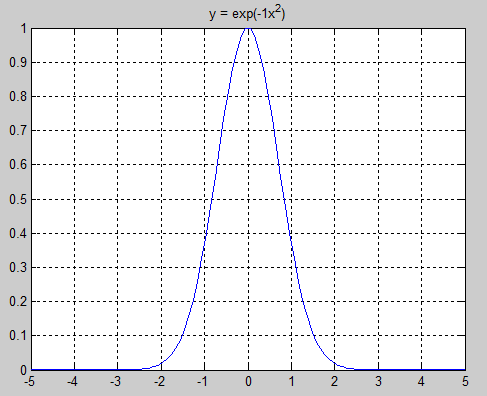
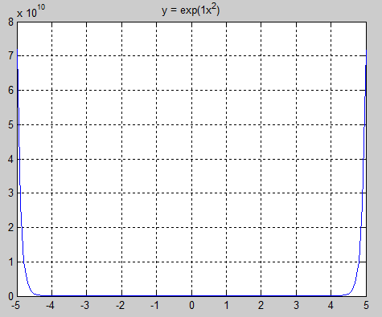
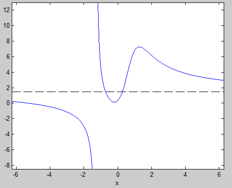
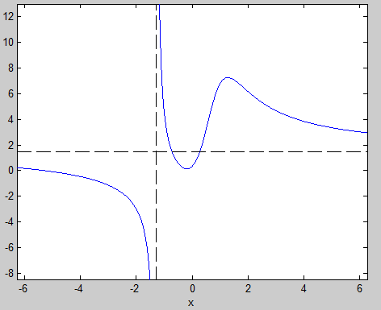
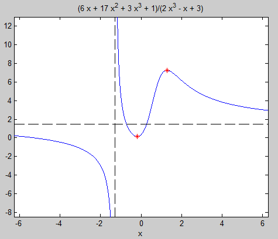
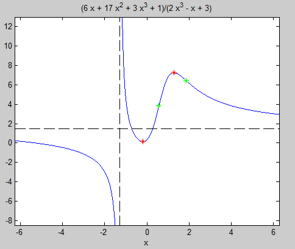
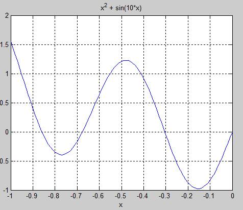
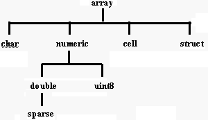
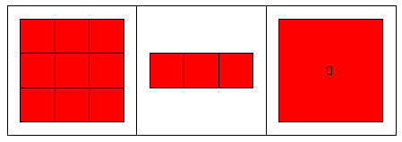

## В этой лекции

* Символьные расчеты: решение задачи в виде формулы. Как создавать символьные объекты.
* Решение уравнений и систем уравнений. Поиск формул для корней уравнения. Что делать, если такой формулы не существует.
* Символьное решение основных задач математического анализа: поиск пределов,
вычисление производных и интегралов, разложение функции в ряд Тейлора, поиск суммы ряда.
* Арифметика заданной точности.
* Преобразование, упрощение и подстановка символьных выражений.
* Исследование функции при помощи Matlab: поиск асимптот, локальных экстремумов и точек перегиба.
* Контейнеры разнородных данных: структуры и ячейки.


## Символьные расчеты

Сравним следующие варианты кода:
```
a = sqrt(2)      % тип double, 8 байт
a = 1.4142
a = sqrt(sym(2)) % sym object, 138 байт (не бит!)
a = 2^(1/2)
```

Здесь `2^(1/2)` -- символьная запись числа, которое нельзя представить ни в виде обычной дроби, ни (за конечное время) в виде дроби десятичной.

Переменная `a` --  символьный объект. Действия над символьными объектами -- **символьные расчеты**.

С помощью символьных расчетов можно раскрыть скобки и преобразовать формулу, найти решение уравнения, предел функции, ее производную, разложить функцию в ряд Тейлора или Фурье, вычислять интегралы и мн. др.


## Создание символьных объектов

*Чтобы работать с «буквенными» выражениями, нужно определить все входящие в них «буквы» как символьные переменные.*

* `syms x y z …` — создание символьных объектов. Запятые между переменными не ставят!

По умолчанию символьные переменные принимают комплексные значения. Но это можно изменить, делая различные предположения:

*	syms a1 a2 … real — переменные определены в области действительных чисел.
*	syms a1 a2 … positive — переменные действительные и положительные.

Тип переменной виден в `Workspace`.


## Решение уравнений и систем

Уравнения представляют в виде
$$
f(x) = 0 .
$$
Системы
$$
\left\{
\begin{array}{l}
f_1(x_1, x_2, \ldots, x_n) = 0, \\
f_2(x_1, x_2, \ldots, x_n) = 0, \\
\ldots \\
f_n(x_1, x_2, \ldots, x_n) = 0. \\
\end{array}
\right.
$$

Запись в MATLAB
```
x = solve(f,x)
[x1,x2,…xn] = solve(f1,f2,…,fn,x1,x2,…xn)
```

`fi` — функции; `xi` — неизвестные.


## ПРИМЕР. Формула корней квадратного уравнения

```
syms x
f = 3*x^2-2*x+1; % Если f(x)=0, то правая часть не нужна
solve(f)
```
Даст 2 корня:
```
 (2^(1/2)*i)/3 + 1/3
 1/3 - (2^(1/2)*i)/3
```
Найдем формулу для корней квадратного уравнения
```
syms a b c x
f = a*x^2+b*x+c;
root = solve(f,x)
```
```
root =
 1/2/a*(-b+(b^2-4*a*c)^(1/2))
 -1/2*(b+(b^2-4*a*c)^(1/2))/a
```


## ПРИМЕР. Решение системы уравнений, зависящих от параметров
$$
\left\{
\begin{array}{l}
ax_1 +x_1 x_2 +1 = 0, \\
x_1^2 +bx_2 = 0,
\end{array}
\right.
$$

``` 
syms a b x1 x2
f1 = a*x1+x1*x2+1; % syms уже не нужен
f2 = x1^2+b*x2;
[x1,x2] = solve(f1,f2,x1,x2)
```
Другой вариант записи
```
[x1,x2] = solve('a*x1+x1*x2+1','x1^2+b*x2','x1','x2')
```
**Если аналитическое решение найти невозможно, возвращается численное значение корней.**


## Предел

limit(f,x,x0) —  вычисление пределов $\lim_{x \rightarrow x_0} f(x)$.

`f` – символьная запись функции $f(x)$, `x` — символьная переменная, `x0` – предельное значение `x`.

Значение 1-го замечательного предела
$$
\lim_{z \rightarrow 0} \frac{\sin z}{z} = 1
$$
```
syms z
f = sin(z)/z;
limit(f,z,0)

ans =
 
1
```


## Производная

`diff(f,x,n)` — вычисление производной функции $f(x)$.

`n` – порядок производной. По умолчанию `n=1`.

```
syms x
f = x*cos(x);
diff(f,x)

ans = 

cos(x) - x*sin(x)
```
Напомним правило:
```
syms u(x) v(x);
d_uv = diff(u(x)*v(x))
d_uv =
 
u(x)*diff(v(x), x) + v(x)*diff(u(x), x)
```


## Интегралы

* `int(f,x)` — неопределенный интеграл вида $\int f(x) dx$. 
* `int(f,x,a,b)` — определенный интеграл $\int_a^b f(x) dx$; $a$, $b$ – границы области интегрирования $[a,b]$.

Вычислим интеграл $\int_0^\pi \sin x dx$

```
>> syms x
>> int(sin(x),x,0,pi)
 
ans =
 
2
```


## sym() превращает строку в символьный объект

$$
\int_0^\pi \sin x dx
$$

```
>> int(sym('sin(x)'),sym('x'),0,pi)
 
ans =
 
2
```


## Несобственные интегралы

`int()` позволяет вычислять несобственные интегралы вида

$$\int_a^{+\infty} f(x) dx, \quad
\int_{-\infty}^b f(x) dx, \quad
\int_{-\infty}^{+\infty} f(x) dx. 
$$

Для этого соответствующий предел интегрирования нужно указать равным `+inf/-inf`.


## ПРИМЕР. Вычисление несобственного интеграла

Вычислим 
$$
\int_{-\infty}^{+\infty} e^{-ax^2} dx .
$$

```
syms a x
f = exp(-a*x^2); % точка не обязательна!
int(f,x,-inf,inf)
```
Результатом выполнения будет сообщение о невозможности найти интеграл. Между тем, он существует и равен $\sqrt{\pi/a}$.


##

Интеграл существует только в предположении, что $a>0$. В этом случае подынтегральная функция будет представлять собой гауссову кривую. 

\bcols
\column{.5\textwidth}

\column{.5\textwidth}

\ecols


## Уточняем область определения `a`

```
syms a positive
syms x
int(exp(-a*x^2),x,-inf,inf)


ans =
 
pi^(1/2)/a^(1/2)
```


## Кратные интегралы

Двойные интегралы вычисляются повторным применением `int()`. Найдем интеграл
$$
\int_c^d\int_a^b y\sin x dx dy
$$
```
syms a b c d x y
Ix = int(y*sin(x),x,a,b);
Iy = int(Ix,y,c,d);
pretty(Iy)

      2    2 
    (c  - d ) (cos(a) - cos(b)) 
  - --------------------------- 
                 2
```


## Разложение функции $f(x)$ в ряд Тейлора

```
taylor(f,x,x0)
```
`f` – функция; `x` – переменная дифференцирования; `x0` – точка, в окрестности которой выполняется разложение. По умолчанию возвращает 5 первых членов ряда.

Разложим в ряд Тейлора функцию $y = \sin x$ в окрестности точки $x=0$
```
syms x
f = sin(x);
df = taylor(f,x)
 
df =
 
  x^5/120 - x^3/6 + x
```


## Суммирование рядов $\sum_{k=1}^\infty f(k)$

```
symsum(f,k,a,b)
```
`k` – индекс суммирования; `a`,`b` – начальное и конечное значения индекса соответственно. 

Вычислим $s = \sum_{k=1}^\infty \frac{(-1)^k}{k^2}$:
```
syms k
f = (-1)^k/k^2;
s = symsum(f,k,1,inf)

s = 

  -1/12*pi^2
```
`symsum` удобно использовать для вычисления сумм, вместо использования циклов.


## Арифметика заданной точности

`vpa(x,n)` вычисляет значение `x` с заданным числом цифр после запятой (`n`).

Вычислим pi с 320 знаками после запятой:
```
my_pi = vpa(pi,320) % my_py - 1x1 sym
 
my_pi =
 
3.14159265358979323846264338327950288419716939937510582
0974944592307816406286208998628034825342117067982148086
5132823066470938446095505822317253594081284811174502841
0270193852110555964462294895493038196442881097566593344
6128475648233786783165271201909145648566923460348610454
3266482133936072602491412737245870066063155882
```


## Преобразование/упрощение выражений: "Вкалывают роботы, счастлив человек"

Точнее: достаточно задать начальные формулы, чтобы система символьных вычислений (система компьютерной математики, computer algebra system) произвела все расчеты и представила результаты в требуемом виде. 

**Но!** Не всегда готовые формулы получаются такими короткими и изящными, как бы нам того хотелось. Все преимущества формулы теряются из-за ее громоздкости. 

Появляется задача: как упростить получено выражение. 


## Отчего появляются длинные формулы?

Отчасти, это связано с тем, что MATLAB не «знает», что для нас важно, а что нет -- и это нужно ему «объяснить». 

Мы можем получать формулы, даже не зная стоящей за ними математической теории. Но чтобы воспользоваться результатами, нужно вспомнить все предположения, которые делаются при расчетах. 

Даже в этом случае результат все равно может получиться громоздким. Тогда можно попробовать упростить его.


## Функции преобразования/упрощения выражений

Функциям преобразований и упрощения выражений в системах для символьных расчетов уделяется большое внимание. В MATLABе существует около дюжины таких функций, в частности:

* `simplify`
* `collect`
* `factor`
* `simple`
* `subs`


## Упрощение символьных выражений: simplify(f)

```
>> f = sin(x)^2+cos(x)^2;
>> simplify(f)

ans =
 
1
```

simplify способен упрощать выражения, содержащие алгебраические и тригонометрические функции, логарифмы и экспоненты, а также некоторые спецфункции.


## `collect` и `factor`

`collect(f,x)` — разложение полинома по степеням независимой переменной.

`x` – переменная, при степенях которой следует находить коэффициенты.
```
>> f = (x-1)*(x-2)*(x-3);
>> collect(f)

ans = x^3-6*x^2+11*x-6
```

`factor(f,x)` представляет полином `f` в виде произведения полиномов низших степеней с рациональными коэффициентами. То есть выполняет операцию, обратную `collect`:
```
>> f = x^3-6*x^2+11*x-6;
>> factor(f)

ans = (x-1)*(x-2)*(x-3)
```


## Упрощение методом грубой силы: `simple()`

`simple(f)` — упрощает символьные выражения, применяя для этого `simplify`, `collect`, `factor` и другие подобные функции, а затем возвращает самый короткий результат. Работает медленнее всех остальных функций упрощения.


## Подстановка одного выражения в другое: subs

```
subs(f,old,new)
```
`f` – выражение, в котором мы собираемся произвести замену; `old` – фрагмент, подлежащий замене; `new` – символьное выражение, которым нужно заменить `old`.
```
f = sym('a^2+b^2');
f1 = subs(f,'a','cos(x)');
f2 = subs(f1,'b','sin(x)');
f2
simplify(f2)
 
f2 = 
      cos(x)^2 + sin(x)^2
ans = 
      1
```


## Куда идти дальше?

Символьные расчеты в MATLAB выполняются с помощью Symbolic Math Toolbox. Чтобы воспользоваться символьными расчетами нужно, чтобы Symbolic Math Toolbox был установлен на вашей машине.

**Toolbox** (набор инструментов) в MATLABе — набор функций, направленных на решение определенной группы задач. 

Для более продвинутых символьных расчетов понадобится самостоятельные системы символьной математики.

Проприетарные:

* [Maple](https://www.maplesoft.com/products/maple/)
* [Mathematica](http://www.wolfram.com/mathematica/online/)

Свободные:

* [Maxima](http://maxima.sourceforge.net). GUI: wxMaxima, поддерживается Jupyter.


## Исследование функции. Первая производная

Вычисление первой производной функции $f(x)$ дает возможность найти локальные максимумы и минимумы.

Найдем первую производную следующей функции
$$
f (x) = \frac{3 x^3 + 17 x^2 + 6 x + 1}{2 x^3 - x + 3}
$$

Запишем символьное выражение
```
syms x
f = (3 * x^3 + 17 * x^2 + 6 * x + 1)/(2 * x^3 - x + 3)
```

Построим график этой функции
```
ezplot(f) % В новых версиях: fplot(f)
```


## Асимптоты

![График функции имеет горизонтальную и вертикальную асимптоты. Локальный минимум находится на промежутке [-1,0], локальный максимум -- в [1,2]](images/fplot.png)


##

По умолчанию символьные величины создаются комплексными, но нам достаточно вещественных значений. Предположим (assume), что `x` является вещественным (`real`):
```
assume(x, 'real')
```
Чтобы найти горизонтальную асимптоту, вычислим предел функции `f` при `x` стремящемся к $+\infty$ и к $-\infty$:
```
hasy = [limit(f, x, sym(inf)), limit(f, x, -sym(inf))]

  hasy =
 
    [ 3/2, 3/2]
```
Добавим асимптоту к графику
```
hold on
line([-10, 10], hasy, 'Color', 'k', 'LineStyle', '--');
```


##




##

Чтобы построить вертикальную асимптоту `f`, найдем корни полинома, являющегося знаменателем `f`:
```
vasy = solve(2 * x^3 + x * -1 + 3 == sym(0), x)

vasy =
 
  - 1/(6*(3/4 - (241^(1/2)*432^(1/2))/432)^(1/3)) - (3/4 -
  (241^(1/2)*432^(1/2))/432)^(1/3)
```
Найдем приближенное значение этого числа при помощи функции `vpa`
```
vpa(vasy,6)

ans =
 
-1.28962
```


##




## Поиск локальных экстремумов

Если точка является локальным экстремумом функции $f(x)$ (минимумом или максимумом), то первая производная $g = f'(x)$ в этой точке равна нулю:
```
g = diff(f, x)

g =
 
(9*x^2 + 34*x + 6)/(2*x^3 - x + 3) - 
((6*x^2 - 1)*(3*x^3 + 17*x^2 + 6*x + 1))/(2*x^3 - x + 3)^2
```


##

Решим уравнение $g(x) = 0$:
```
solve(g == 0, x);
extrema = vpa(ans, 6)

extrema =
 
   1.28598
 -0.189245
```

Теперь у нас есть координаты экстремумов. Тип экстремума (максимум или минимум) определим, пользуясь 2-ой производной $h = f''(x)$.

* $f''(x_0) > 0$, $x_0$ -- минимум;
* $f''(x_0) < 0$, $x_0$ -- максимум;
* $f''(x_0) = 0$, $x_0$ -- ?


##

```
h = simplify(diff(f, x, 2))    % h = simplify(diff(g, x))
subs(h, x, extrema)

ans =
 
 -9.148586299108628836484272395515
 9.7356976182397201186055335918601
```

Таким образом: 

* $x_1 = 1.28598$ -- максимум,
* $x_2 = -0.189245$ -- минимум.


##




## Точки перегиба

$f''(x_0) = 0$, $x_0$ -- точка перегиба.
```
inflection = vpa(solve(h == 0, x),6)


inflection =
 
  1.86515
 0.578718
```


##




## fminbnd(f,a,b) -- поиск экстремумов $f(x)$ на интервале $[a;b]$




##
```
f = @(x) x.^2 + sin(10*x);

x = -1:.01:0;
y = f(x);
plot(x,y), grid on

fminbnd(f,-1,-0.6)


ans = 

     -0.76994
```


##

```
[x ymin] = fminbnd(f,-0.6,-0.4)

  x = 
       -0.5999
       
  ymin = 
        0.6399

[x ymin] = fminbnd(f,-0.4,0)

  x = 
       -0.15400
       
  ymin = 
        -0.97581
```


## Больше методов оптимизации

\Large

* Optimization Toolbox (fminsearch)
* Global Optimization Toolbox
    * Прямые методы поиска
    * Генетические алгоритмы
    * Метод имитации отжига
    * Многоцелевая оптимизация


## Таблица типов данных в MATLAB




## Структуры 

представляет собой элемент данных, содержащий разнотипные поля.

```
S.name = 'Juan Петров';
S.date = '5-05-2010';
S.grade = 4;
```

создает структуру S с тремя полями: `name` (строка), `date` (строка), `grade` (число). Поля отделяются от имени структуры точкой.

Как и всё в MATLAB, структуры являются массивами. Каждый элемент такого массива структур является структурой с несколькими полями. 


## Поля структуры могут добавляться

* по одному

```
S(2).name = 'Маша Антипенко';
S(2).date = '6-05-2010';
S(2).grade = 5;
```
Индекс конкретной структуры в массиве указывается после имени массива.

* вместе, с помощью функции `struct`

```
S(3) = struct('name','Света Захарова','date', ...
              '7-05-2010','grade',4)
```


## Когда использовать

Обычные массивы удобны при работе с однородными данными — только числами или только строками. 

Массив структур удобно использовать, когда информация может быть представлена в виде таблицы.

Структуры используются функциями MATLAB

* для настройки параметров,
* для сообщения дополнительных подробностей о результате.

Например, структуры используются функциями, реализующими вычислительные методы. Кроме результата такие функции могут сообщать об используемом методе, о количестве сделанных приближений и т.п., т.е. информацию которую нельзя представить в виде только чисел или только строк.


## Массивы ячеек

Ячейку можно представить себе как контейнер для хранения любых данных, а массив ячеек — как набор таких контейнеров — «камеру хранения»:




## 

Элементами массива ячеек (cell array) могут быть любые типы данных, в том числе и другие массивы ячеек. 

Мы уже не раз использовали массивы ячеек: в виде массивов ячеек организовано хранение входных и выходных параметров функций.

Массив ячеек создается путем заключения группы объектов в фигурные скобки:
```
A = eye(3,3);
С = {A sum(A) prod(prod(А))}
```

дает массив ячеек C размерности 1x3. Эти три клетки содержат: 1) матрицу A, 2) вектор-строку с суммами столбцов этой матрицы и 3) произведение ее элементов:
```
С =
[3x3 double]    [1x3 double]    [0]
```


##

Для просмотра содержимого ячеек, помимо Array Editor, используются функции `celldisp` и `cellplot`.
 
`cell(m,n)` — создает массив ячеек размера m х n, элементами которого являются пустые матрицы. Эту функцию удобно использовать для предварительного выделения памяти под массив ячеек.

Для получения доступа к содержимому ячеек используются индексы элементов, заключенные в фигурные скобки. Например, `С{1}` возвращает матрицу `A`, а `С{3}` — число `0`.

Если нужно извлечь из хранящихся в ячейке данных отдельный элемент, например элемент первой строки и второго столбца — `(1,2)` — матрицы, хранящейся в ячейке `C{1}`, нужно набрать `C{1}(1,2)`.


## Важно!

\Large

Массивы ячеек содержат *копии* других массивов, а не ссылки на них. 

Поэтому, если вы впоследствии измените матрицу `А`, с массивом ячеек `С` ничего не произойдет.


## Резюме

для хранения разнотиповых и "разноразмерных" данных в одной переменной  используются: 

1. массивы структур: `structArray(structIndex).Field`
2. массивы ячеек: `cellArray{cellIndex}`

Выбор типа составных данных зависит от конкретной задачи. Спросите себя, что вы предпочтете: обращаться к элементам переменной по именам или по номерам. В первом случае вам понадобится массив структур, во втором — массив ячеек. 

Эти типы данных можно представлять себе как таблицы — с заголовками (структуры) и без заголовков (ячейки).

Переход между структурами и ячейками выполняется с помощью функций `cell2struct` и `struct2cell`.


## Ссылки

* [Maxima, Minima, and Inflection Points](https://se.mathworks.com/help/symbolic/examples/maxima-minima-and-inflection-points.html)
* [Extreme Values of Functions](http://faculty.cooper.edu/smyth/TechCompanion/Calc1/Ch04/ExtremeValues.htm)

